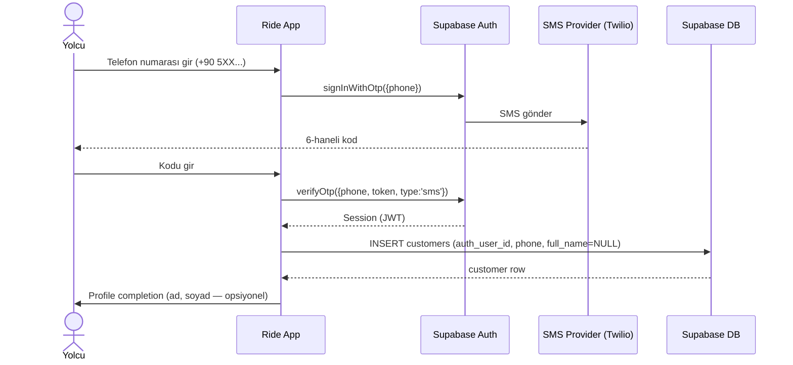
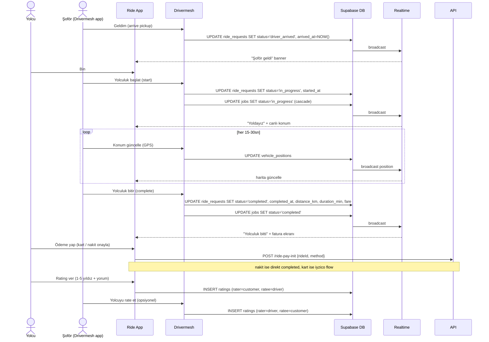
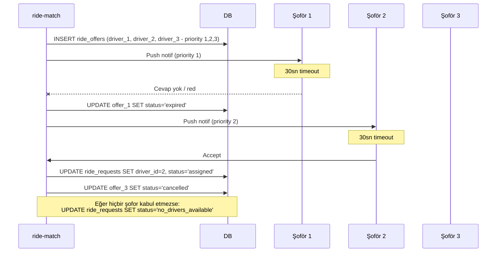
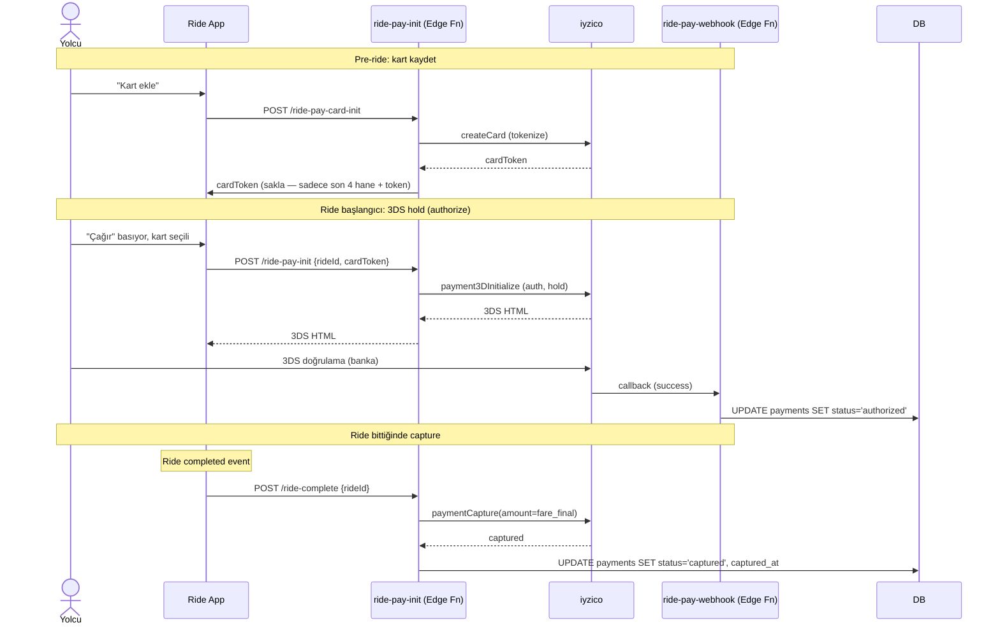
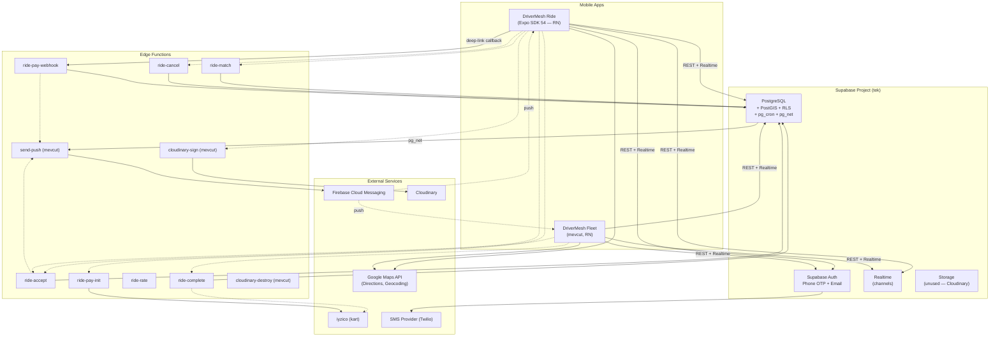

# DriverMesh Ride — Tasarım Taslağı (DRAFT)

> **Durum:** SPEC / DRAFT. Bu doküman henüz uygulanmamış bir greenfield mobile app'in mimari ve ürün tasarımıdır. Final değildir. Kullanıcı her bir `OPEN QUESTION` için karar verdikten sonra v1.0'a sabitlenecektir.
>
> **Tarih:** 2026-05-13
> **Versiyon:** 0.1 — ilk taslak
> **Yazar:** Backend Architect (Claude)
> **Hedef:** DriverMesh fleet app'inin müşteri-yolcu tarafının (Uber/BiTaksi tarzı) mevcut filo altyapısına bağlanan yeni bir mobile app olarak tasarlanması.

---

## 1. Vision & Skopu

### 1.1 Neden var?

DriverMesh fleet app'i bugün **şirket içi/B2B** bir araç. Patron, müşteri taşıma işlerini manuel oluşturuyor, şoföre atıyor. Müşteri — yani gerçek yolcu — sistemin dışında: telefonla arıyor, WhatsApp'tan yazıyor, kapıda nakit ödüyor. Bu klasik bir taksi/transfer şirketi modeli.

**DriverMesh Ride** bu zinciri **müşteri uçundan** uzatır. Yolcu kendi app'inden ride çağırır → DriverMesh fleet'lerinin altyapısı arkada çalışır → en uygun filo+şofor eşleştirilir → yolculuk yapılır → app içinden ödenir/değerlendirilir.

**Anahtar fark:** Uber/BiTaksi gibi tek bir merkezi havuz değil; **çoklu DriverMesh fleet'lerinin tüketici uçudur**. Her fleet kendi araçlarını/şoförlerini yönetmeye devam eder, sadece müşteri-talep girişi bu app'ten gelir.

### 1.2 Ne yapar (MVP)

| Özellik | MVP | V1 | V2 |
|---|---|---|---|
| Yolcu kayıt + telefon doğrulama | ✓ | | |
| Ride request (pickup + dropoff) | ✓ | | |
| Fiyat tahmini (statik tarife) | ✓ | | |
| En yakın uygun şoför eşleştirme | ✓ | | |
| Şoför kabul/red | ✓ | | |
| Yolculuk durumu takibi (live) | ✓ | | |
| Yolculuk sonu tamamlama | ✓ | | |
| Kapıda nakit ödeme | ✓ | | |
| Kart ödeme (iyzico/PayTR) | | ✓ | |
| Çift yönlü rating | | ✓ | |
| Çoklu şehir (region matrix) | | ✓ | |
| Surge pricing (dinamik) | | | ✓ |
| In-app cüzdan + bakiye | | | ✓ |
| Multilang yolcu UI (EN/AR) | | | ✓ |
| Scheduled ride (ileri tarihli) | | | ✓ |
| Multi-stop ride | | | ✓ |
| Sürücü tercihi (kadın şoför vb.) | | | ✓ |

### 1.3 Ne yapmaz (out of scope)

- **Yemek/paket teslimat** — DriverMesh Ride saf insan taşıma. Eşya/kurye için ayrı bir lifecycle (DriverMesh Cargo?) gerekir.
- **Şehirler arası uzun yol** — MVP şehir-içi. Şehirler arası fiyat/regülasyon farklı.
- **Marketplace ödeme split** — fleet payout hesabını filo şirketi yapar; app commission almaz (MVP). V2'de revisit edilebilir.
- **Tek bir merkezi taksi havuzu** — DriverMesh Ride bağımsız bir taksi şirketi değildir; mevcut DriverMesh fleet'lerinin satış kanalıdır.

### 1.4 Karşılaştırma

| Özellik | Uber/BiTaksi | DriverMesh Ride |
|---|---|---|
| Şoför havuzu | Merkezi (Uber kayıtlı bağımsız sürücü) | Dağıtık (DriverMesh fleet'lerinin şoförleri) |
| Araç sahipliği | Şoför / filo | Filo (DriverMesh patronu) |
| Komisyon modeli | %20-25 platform | MVP'de 0 (kullanıcı tercihi — OPEN Q) |
| Coğrafi kapsama | Şehir bazlı, merkezi karar | Fleet bazlı, patron toggle |
| Onboarding | Uber sürücüsü olmak | Önce DriverMesh fleet'i kurmak gerekiyor |
| Ödeme | Çoğu kartla | Kart + cash + (V2) cüzdan |

---

## 2. Aktörler ve Roller

### 2.1 Aktör matrisi

| Aktör | App | Auth | Yeni mi? | Açıklama |
|---|---|---|---|---|
| **Yolcu (passenger)** | DriverMesh Ride (yeni) | `customers` tablosu — auth.users | EVET (yeni rol) | Ride çağıran müşteri |
| **Şoför (driver)** | DriverMesh (mevcut) | `profiles.role='driver'` | Mevcut | Ride request bildirimi alır, kabul/red eder, yolculuğu yapar |
| **Patron (owner)** | DriverMesh (mevcut) | `profiles.role='owner'` | Mevcut | Fleet'in Ride'a katılımını toggle eder, kapsama bölgesi/saat ayarlar, payout alır |
| **Yönetici (manager)** | DriverMesh (mevcut) | `profiles.role='manager'` | Mevcut | Patron yetkisi verdiyse Ride ayarlarını yönetebilir; ride listesini görür |
| **Platform admin** | (V2 — back-office) | — | Yeni | İlerideki bir tarihte; MVP'de yok |

### 2.2 OPEN QUESTION 1 — Şoför auth: ortak hesap mı, ayrı mı?

**Soru:** Drivermesh Ride'taki "şoför" kaydı, mevcut Drivermesh fleet app'indeki driver profile ile **aynı `auth.users` hesabı** mı kullanmalı, yoksa ayrı bir hesap mı olmalı?

**Seçenek A — Aynı hesap (önerilen):**
- Drivermesh Ride bir "müşteri app'idir"; şoför Drivermesh Ride app'ine **GİRMEZ**. Şoför mevcut Drivermesh app'inden çalışır.
- Ride request geldiğinde mevcut `notifications` + push pipeline'ı kullanılır.
- `jobs` tablosuna `source='ride'` ile job düşer; şoför fleet app'inde işi normal görür (sadece UI'da "Ride" rozeti gözükür).
- **Pro:** Tek auth, tek profile, tek push token, tek shift state. Zero duplikasyon.
- **Con:** Drivermesh fleet app'inin Ride-specific UI etmeleri (live ETA broadcast, rating göster vb.) gerekir.

**Seçenek B — Ayrı hesap:**
- Şoför Ride'a kayıt olur, sonra fleet'e attach edilir.
- Drivermesh fleet app'i Ride'dan habersiz çalışmaya devam eder.
- **Pro:** Drivermesh fleet app'i değişmez.
- **Con:** Şoförün iki app yüklemesi, iki giriş, iki push token; UX kabusu. Senkronizasyon dertleri.

**Tasarımcı önerisi:** **Seçenek A.** Drivermesh fleet app'ine "Ride entegrasyonu" feature flag'ı eklenir. Şoför tek app kullanır.

→ **KARAR İSTENEN.**

### 2.3 OPEN QUESTION 2 — Yolcu auth identity provider

**Soru:** Yolcu kaydı hangi auth metodu ile?

- **A) Telefon + SMS OTP (önerilen)** — Türkiye standartı, yolcu zaten telefon vermek zorunda (şoför arasın diye).
- **B) Email + şifre** — Drivermesh fleet ile aynı, ama yolcu için iş gücü.
- **C) Sosyal (Google/Apple)** — modern, ama Apple Sign-In zorunlu (App Store), Google Türkiye'de daha popüler.
- **D) Hepsi (passwordless + sosyal)** — en iyi UX, en büyük effort.

**Tasarımcı önerisi:** **A** MVP için, **D** V1+ için. Supabase Auth phone provider (Twilio/MessageBird/Vonage SMS).

→ **KARAR İSTENEN.**

---

## 3. Ana Akışlar (Sequence Diagrams)

### 3.1 Müşteri kayıt + telefon doğrulama (önerilen — Seçenek A)



### 3.2 Ride request — happy path

```mermaid
sequenceDiagram
    actor C as Yolcu
    participant RA as Ride App
    participant API as ride-match (Edge Fn)
    participant DB as Supabase DB
    participant RT as Realtime
    participant DM as Drivermesh (Driver)

    C->>RA: Pickup nokta seç (harita pin)
    C->>RA: Dropoff nokta seç
    C->>RA: Araç tipi seç (Standard/XL — V2)
    RA->>API: POST /ride-quote {pickup, dropoff, vehicleType}
    API->>DB: SELECT fare_config WHERE region=X
    API-->>RA: { price_estimate, distance_km, duration_min }
    C->>RA: "Çağır" butonuna bas
    RA->>API: POST /ride-request {pickup, dropoff, vehicleType, paymentMethod}
    API->>DB: INSERT ride_requests (status='searching')
    API->>DB: SELECT nearby_available_vehicles (PostGIS)
    API->>DB: INSERT ride_offers (1 satır × N şofor)
    API->>RT: broadcast 'ride_offered' to driver channels
    RT-->>DM: Push + Realtime event (3 driver paralel)
    DM->>API: POST /ride-accept {offerId} (ilk gelen)
    API->>DB: UPDATE ride_requests SET driver_id, status='assigned' WHERE ... AND status='searching'
    Note over API,DB: row-level lock; ilk UPDATE kazanır
    API->>DB: UPDATE diğer ride_offers SET status='expired'
    API->>DB: INSERT jobs (source='ride', vehicle_id, driver_id, ...)
    API->>RT: broadcast 'ride_accepted' (yolcu + diğer şofor'lere)
    RT-->>RA: ETA + driver info
    RT-->>DM: Diğer şofor'lerin teklifi kapanır
    Note over DM: Şofor app'i ride job'u görür (jobs ekranı)
```

### 3.3 Ride lifecycle — kabul → tamamlanma



### 3.4 İptal akışları

```mermaid
sequenceDiagram
    actor C as Yolcu
    participant RA as Ride App
    participant DB as DB

    Note over C,DB: Senaryo: yolcu şoför bulunmadan iptal eder
    C->>RA: İptal et
    RA->>DB: UPDATE ride_requests SET status='cancelled_by_customer' WHERE status='searching'
    Note over RA,DB: Ücret yok; offers expire

    Note over C,DB: Senaryo: şoför kabul ettikten SONRA yolcu iptal eder
    C->>RA: İptal et
    RA->>DB: UPDATE ride_requests SET status='cancelled_by_customer'
    DB->>DB: UPDATE jobs SET status='cancelled'
    Note over RA,DB: V1: 30sn sonra iptal ücreti? (OPEN Q)
```

### 3.5 Matching fallback (şoför kabul etmezse)



---

## 4. Veri Modeli

### 4.1 ER diyagramı (yeni tablolar + mevcut bağlantılar)

```mermaid
erDiagram
    auth_users ||--o| customers : "1-1 (yeni rol)"
    auth_users ||--o| profiles : "1-1 (mevcut: owner/manager/driver)"

    customers ||--o{ ride_requests : "creates"
    ride_requests ||--o{ ride_offers : "fan-out"
    ride_requests ||--o| jobs : "1-1 (source='ride')"
    ride_requests ||--o| payments : "1-1"
    ride_requests ||--o{ ratings : "0-2 (çift yönlü)"

    profiles ||--o{ ride_offers : "driver_id"
    organizations ||--o{ fleets_visibility : "fleet ride coverage"
    organizations ||--o{ ride_requests : "matched fleet"

    vehicles ||--o{ ride_requests : "assigned vehicle"

    customers {
        uuid id PK
        uuid auth_user_id FK
        text phone
        text full_name
        text email
        text avatar_url
        timestamptz created_at
        timestamptz last_ride_at
    }

    ride_requests {
        uuid id PK
        uuid customer_id FK
        uuid organization_id FK "matched fleet"
        uuid vehicle_id FK
        uuid driver_id FK profiles
        uuid job_id FK
        geography pickup_point "PostGIS"
        text pickup_address
        geography dropoff_point
        text dropoff_address
        text vehicle_type "standard/xl/comfort"
        text status "state machine"
        numeric fare_estimate
        numeric fare_final
        numeric distance_km
        int duration_min
        text payment_method "card/cash/wallet"
        text payment_status
        timestamptz requested_at
        timestamptz assigned_at
        timestamptz arrived_at
        timestamptz started_at
        timestamptz completed_at
        timestamptz cancelled_at
        text cancel_reason
    }

    ride_offers {
        uuid id PK
        uuid ride_request_id FK
        uuid driver_id FK
        uuid vehicle_id FK
        int priority "1=first try"
        text status "pending/accepted/rejected/expired/cancelled"
        int eta_seconds
        numeric distance_meters
        timestamptz offered_at
        timestamptz responded_at
    }

    payments {
        uuid id PK
        uuid ride_request_id FK
        text method "card/cash/wallet"
        text gateway "iyzico/paytr/null"
        text gateway_ref
        numeric amount
        text currency "TRY"
        text status "pending/captured/refunded/failed"
        jsonb gateway_payload
        timestamptz created_at
        timestamptz completed_at
    }

    ratings {
        uuid id PK
        uuid ride_request_id FK
        uuid rater_id "customer.id OR profile.id"
        text rater_type "customer/driver"
        uuid ratee_id
        text ratee_type
        int stars "1-5"
        text comment
        timestamptz created_at
    }

    fleets_visibility {
        uuid id PK
        uuid organization_id FK
        boolean ride_enabled
        geography service_area "polygon (PostGIS)"
        jsonb operating_hours "weekday → [start, end]"
        text[] vehicle_types_offered
        numeric base_fare_override
        timestamptz updated_at
    }
```

### 4.2 SQL şema taslakları

#### 4.2.1 customers

```sql
CREATE TABLE customers (
  id UUID PRIMARY KEY DEFAULT gen_random_uuid(),
  auth_user_id UUID UNIQUE NOT NULL REFERENCES auth.users(id) ON DELETE CASCADE,
  phone TEXT UNIQUE NOT NULL,
  full_name TEXT,
  email TEXT,
  avatar_url TEXT,
  default_payment_method TEXT CHECK (default_payment_method IN ('card', 'cash', 'wallet')),
  language TEXT DEFAULT 'tr' CHECK (language IN ('tr', 'en')),
  push_token TEXT,
  push_platform TEXT CHECK (push_platform IN ('fcm', 'apns')),
  push_token_updated_at TIMESTAMPTZ,
  blocked BOOLEAN DEFAULT false,
  blocked_reason TEXT,
  total_rides INT DEFAULT 0,
  avg_rating NUMERIC(2,1),
  last_ride_at TIMESTAMPTZ,
  created_at TIMESTAMPTZ DEFAULT NOW()
);

CREATE INDEX idx_customers_auth_user ON customers(auth_user_id);
CREATE INDEX idx_customers_phone ON customers(phone);
```

#### 4.2.2 ride_requests (ana tablo — state machine)

```sql
CREATE TYPE ride_status AS ENUM (
  'searching',          -- şoför aranıyor
  'no_drivers_available', -- timeout / kimse kabul etmedi
  'assigned',           -- şoför kabul etti, yola çıktı
  'driver_arrived',     -- pickup'a vardı
  'in_progress',        -- yolcu bindi, yola çıkıldı
  'completed',          -- bitti
  'cancelled_by_customer',
  'cancelled_by_driver',
  'cancelled_by_system' -- hata, fraud, etc
);

CREATE TYPE ride_vehicle_type AS ENUM (
  'standard',  -- normal binek
  'comfort',   -- daha lüks (V1)
  'xl',        -- van/minibus (V1)
  'taxi'       -- sarı plaka taksi (V1, regülasyon görece kolay)
);

CREATE TYPE ride_payment_method AS ENUM ('card', 'cash', 'wallet');
CREATE TYPE ride_payment_status AS ENUM ('pending', 'authorized', 'captured', 'refunded', 'failed');

CREATE TABLE ride_requests (
  id UUID PRIMARY KEY DEFAULT gen_random_uuid(),
  customer_id UUID NOT NULL REFERENCES customers(id) ON DELETE RESTRICT,

  -- matching outcome (NULL when searching)
  organization_id UUID REFERENCES organizations(id),
  vehicle_id UUID REFERENCES vehicles(id),
  driver_id UUID REFERENCES profiles(id),
  job_id UUID UNIQUE REFERENCES jobs(id),

  -- location (PostGIS)
  pickup_point GEOGRAPHY(POINT, 4326) NOT NULL,
  pickup_address TEXT NOT NULL,
  dropoff_point GEOGRAPHY(POINT, 4326) NOT NULL,
  dropoff_address TEXT NOT NULL,

  -- pricing
  vehicle_type ride_vehicle_type DEFAULT 'standard',
  fare_estimate NUMERIC(10,2) NOT NULL,
  fare_final NUMERIC(10,2),
  distance_km NUMERIC(6,2),
  duration_min INT,
  surge_multiplier NUMERIC(3,2) DEFAULT 1.0,

  -- state
  status ride_status NOT NULL DEFAULT 'searching',
  cancel_reason TEXT,

  -- payment
  payment_method ride_payment_method NOT NULL,
  payment_status ride_payment_status DEFAULT 'pending',

  -- timestamps
  requested_at TIMESTAMPTZ DEFAULT NOW(),
  assigned_at TIMESTAMPTZ,
  arrived_at TIMESTAMPTZ,
  started_at TIMESTAMPTZ,
  completed_at TIMESTAMPTZ,
  cancelled_at TIMESTAMPTZ,

  CONSTRAINT chk_cancel_reason
    CHECK (status NOT LIKE 'cancelled%' OR cancel_reason IS NOT NULL)
);

-- PostGIS spatial index for matching
CREATE INDEX idx_ride_requests_pickup_gist ON ride_requests USING GIST (pickup_point);
CREATE INDEX idx_ride_requests_status ON ride_requests(status) WHERE status IN ('searching', 'assigned', 'in_progress');
CREATE INDEX idx_ride_requests_customer ON ride_requests(customer_id, requested_at DESC);
CREATE INDEX idx_ride_requests_driver ON ride_requests(driver_id, requested_at DESC) WHERE driver_id IS NOT NULL;
CREATE INDEX idx_ride_requests_org ON ride_requests(organization_id, requested_at DESC) WHERE organization_id IS NOT NULL;
```

#### 4.2.3 ride_offers

```sql
CREATE TYPE ride_offer_status AS ENUM ('pending', 'accepted', 'rejected', 'expired', 'cancelled');

CREATE TABLE ride_offers (
  id UUID PRIMARY KEY DEFAULT gen_random_uuid(),
  ride_request_id UUID NOT NULL REFERENCES ride_requests(id) ON DELETE CASCADE,
  driver_id UUID NOT NULL REFERENCES profiles(id),
  vehicle_id UUID NOT NULL REFERENCES vehicles(id),
  organization_id UUID NOT NULL REFERENCES organizations(id),

  priority INT NOT NULL,           -- 1 = ilk dene
  eta_seconds INT NOT NULL,
  distance_meters INT NOT NULL,

  status ride_offer_status DEFAULT 'pending',
  offered_at TIMESTAMPTZ DEFAULT NOW(),
  responded_at TIMESTAMPTZ,
  expires_at TIMESTAMPTZ NOT NULL,  -- offered_at + 30sn (TBD)

  UNIQUE (ride_request_id, driver_id)
);

CREATE INDEX idx_ride_offers_driver_pending ON ride_offers(driver_id, status) WHERE status = 'pending';
CREATE INDEX idx_ride_offers_request ON ride_offers(ride_request_id, priority);
```

#### 4.2.4 payments

```sql
CREATE TABLE payments (
  id UUID PRIMARY KEY DEFAULT gen_random_uuid(),
  ride_request_id UUID NOT NULL REFERENCES ride_requests(id) ON DELETE RESTRICT,
  method ride_payment_method NOT NULL,
  gateway TEXT,                       -- 'iyzico' | 'paytr' | NULL (cash)
  gateway_ref TEXT,                   -- iyzico paymentId
  amount NUMERIC(10,2) NOT NULL,
  currency TEXT DEFAULT 'TRY',
  status ride_payment_status DEFAULT 'pending',
  gateway_payload JSONB,              -- iyzico response saklama
  failure_reason TEXT,
  created_at TIMESTAMPTZ DEFAULT NOW(),
  authorized_at TIMESTAMPTZ,
  captured_at TIMESTAMPTZ,
  refunded_at TIMESTAMPTZ
);

CREATE INDEX idx_payments_ride ON payments(ride_request_id);
CREATE INDEX idx_payments_status ON payments(status) WHERE status IN ('pending', 'authorized');
```

#### 4.2.5 ratings (çift yönlü)

```sql
CREATE TABLE ratings (
  id UUID PRIMARY KEY DEFAULT gen_random_uuid(),
  ride_request_id UUID NOT NULL REFERENCES ride_requests(id) ON DELETE CASCADE,
  rater_type TEXT NOT NULL CHECK (rater_type IN ('customer', 'driver')),
  rater_id UUID NOT NULL,             -- customers.id veya profiles.id
  ratee_type TEXT NOT NULL CHECK (ratee_type IN ('customer', 'driver')),
  ratee_id UUID NOT NULL,
  stars INT NOT NULL CHECK (stars BETWEEN 1 AND 5),
  comment TEXT,
  created_at TIMESTAMPTZ DEFAULT NOW(),

  UNIQUE (ride_request_id, rater_type)
);

CREATE INDEX idx_ratings_ratee ON ratings(ratee_type, ratee_id);
```

#### 4.2.6 fleets_visibility

```sql
CREATE TABLE fleets_visibility (
  id UUID PRIMARY KEY DEFAULT gen_random_uuid(),
  organization_id UUID UNIQUE NOT NULL REFERENCES organizations(id) ON DELETE CASCADE,
  ride_enabled BOOLEAN DEFAULT false,
  service_area GEOGRAPHY(POLYGON, 4326),   -- patron çizdiği polygon
  operating_hours JSONB DEFAULT '{"mon":["00:00","23:59"],"tue":[...]}'::jsonb,
  vehicle_types_offered TEXT[] DEFAULT ARRAY['standard'],
  base_fare_override NUMERIC(10,2),        -- bu fleet için özel taban tarife (NULL = default)
  commission_rate NUMERIC(4,2) DEFAULT 0,  -- platform commission % (MVP'de 0)
  updated_at TIMESTAMPTZ DEFAULT NOW()
);

CREATE INDEX idx_fleets_visibility_area_gist ON fleets_visibility USING GIST (service_area);
CREATE INDEX idx_fleets_visibility_enabled ON fleets_visibility(ride_enabled) WHERE ride_enabled = true;
```

#### 4.2.7 fare_config (region/zone bazlı tarife)

```sql
CREATE TABLE fare_config (
  id UUID PRIMARY KEY DEFAULT gen_random_uuid(),
  region_code TEXT NOT NULL,       -- 'IST', 'ANK', 'IZM'
  vehicle_type ride_vehicle_type NOT NULL,
  base_fare NUMERIC(10,2) NOT NULL,   -- açılış ücreti
  per_km NUMERIC(10,2) NOT NULL,
  per_min NUMERIC(10,2) NOT NULL,
  min_fare NUMERIC(10,2) NOT NULL,    -- minimum kabul ücret
  surge_enabled BOOLEAN DEFAULT false,
  effective_from TIMESTAMPTZ DEFAULT NOW(),
  effective_until TIMESTAMPTZ,
  UNIQUE (region_code, vehicle_type, effective_from)
);
```

#### 4.2.8 jobs tablosu — mapping (mevcut tabloya)

`jobs` tablosunda `source` enum'unda `'ride'` zaten var (mevcut schema). Ride request kabul edilince:

```sql
INSERT INTO jobs (
  organization_id,
  customer_name,        -- ride_requests.customer_id'den join: customer.full_name veya phone
  pickup_address, pickup_lat, pickup_lng,
  dropoff_address, dropoff_lat, dropoff_lng,
  status,               -- 'assigned'
  source,               -- 'ride'
  vehicle_id, driver_id,
  created_by,           -- NULL veya system user? (OPEN Q)
  notes                 -- "Ride request #{ride_request_id} — fare estimate ₺75"
) RETURNING id;

UPDATE ride_requests SET job_id = <inserted_job_id> WHERE id = ...;
```

**Bidirectional cascade kuralı:**
- `ride_requests.status='in_progress'` → `jobs.status='in_progress'` (trigger)
- `jobs.status='completed'` + source='ride' → `ride_requests.status='completed'`
- `ride_requests.status='cancelled_by_customer'` → `jobs.status='cancelled'`

→ **OPEN QUESTION 3:** Cascade trigger'lar mı, application-level mi? Trigger daha güvenli (eventual consistency yok), application daha esnek (race condition yönetimi kolay). Önerim: **trigger** — atomicity tabloda kalır.

### 4.3 Mevcut jobs tablosuna eklenecek alanlar (opsiyonel)

```sql
ALTER TABLE jobs
  ADD COLUMN ride_request_id UUID REFERENCES ride_requests(id),
  ADD COLUMN ride_fare_estimate NUMERIC(10,2),
  ADD COLUMN ride_fare_final NUMERIC(10,2);

CREATE INDEX idx_jobs_ride_request ON jobs(ride_request_id) WHERE ride_request_id IS NOT NULL;
```

Bu sayede şoför fleet app'inde job detayına bakarken ride bilgisini direkt görür.

---

## 5. Matching Algoritması

### 5.1 Hedef

Bir ride request için, **adil, hızlı, başarılı bir eşleşme** sağlamak. Adillik = filolar arası iş dağılımı; hız = yolcunun beklemesi minimum; başarı = ilk teklif kabul edilen yüksek olasılık.

### 5.2 Adımlar

#### Adım 1 — Aday fleet filtresi

```sql
SELECT o.id AS organization_id
FROM organizations o
JOIN fleets_visibility fv ON fv.organization_id = o.id
WHERE fv.ride_enabled = true
  AND ST_Contains(fv.service_area::geometry, $pickup_point::geometry)
  AND ($vehicle_type = ANY(fv.vehicle_types_offered))
  AND is_within_operating_hours(fv.operating_hours, NOW());
```

#### Adım 2 — Aday araç/şoför filtresi

Şu kriterler:
1. Aracın `status='active'` AND `is_at_hq=false` ya da `is_at_hq=true` (her ikisi de uygun çünkü HQ'da bekleyen araç boş demek)
2. Aracın **aktif (assigned/in_progress) işi yok**
3. Şoförün `profiles.role='driver'`, son 15dk'da heartbeat var (online)
4. Şoför **online ride mode** açık (yeni profil bayrağı: `profiles.ride_online`)
5. Araç pickup'tan max R km uzakta (R = 5 km MVP, çevre-yoğunluk göre dinamik — V2)

```sql
WITH candidate_orgs AS ( /* Adım 1 */ ),
nearby AS (
  SELECT
    v.id AS vehicle_id,
    p.id AS driver_id,
    v.organization_id,
    ST_Distance(v.last_position, $pickup_point::geography) AS distance_m,
    p.avg_rating,
    p.ride_online
  FROM vehicles v
  JOIN profiles p ON p.id = v.assigned_driver_id  -- TBD: araç-şoför pairing kaynağı
  WHERE v.organization_id IN (SELECT organization_id FROM candidate_orgs)
    AND v.status = 'active'
    AND NOT EXISTS (
      SELECT 1 FROM jobs j
      WHERE j.vehicle_id = v.id AND j.status IN ('assigned', 'in_progress')
    )
    AND p.ride_online = true
    AND p.last_seen_at > NOW() - INTERVAL '15 minutes'
    AND ST_DWithin(v.last_position, $pickup_point::geography, 5000)
)
SELECT * FROM nearby
ORDER BY distance_m ASC, avg_rating DESC NULLS LAST
LIMIT 5;
```

→ **OPEN QUESTION 4:** Araç-şoför pairing kaynağı? Drivermesh'te şu an direkt `vehicles.assigned_driver_id` yok. Şoför app'inde "vardiya başlat → bu aracı al" mekanizması mı gerekecek? Önerim: **`driver_shifts` yeni tablosu** — driver_id, vehicle_id, started_at, ended_at_NULL = aktif. Ride matching aktif shift'i okur.

#### Adım 3 — Skorlama

Mesafe tek başına yeterli değil. Composite score:

```
score = (W_distance × normalize(distance_m, 5000)) +
        (W_eta × normalize(eta_s, 600)) +
        (W_rating × (5 - avg_rating) / 5) +
        (W_fairness × org_recent_ride_ratio)

(lower score = better match)
```

Ağırlıklar (önerilen başlangıç):
| Faktör | W |
|---|---|
| `W_distance` | 0.40 |
| `W_eta` | 0.30 |
| `W_rating` | 0.20 |
| `W_fairness` | 0.10 |

→ **OPEN QUESTION 5:** Skorlama formülü ve ağırlıklar — analytics olmadan bu rakamlar tahmin. MVP basit başla (sadece distance), V1'de a/b test ile ayarla.

#### Adım 4 — Fan-out vs. tek tek

**Strateji A — Fan-out (paralel teklif):**
- Top 3 şoföre AYNI ANDA push at, ilk kabul eden alır.
- **Pro:** Hızlı, kabul oranı yüksek.
- **Con:** Şoför "bana özel" hissetmez; iş daha sık reddedilir; gereksiz bildirim.

**Strateji B — Sıralı teklif:**
- En iyi 1 şoföre teklif, 30sn timeout, sonra 2'nciye geç.
- **Pro:** Şoför daha angaje, ödüllendirme adil.
- **Con:** Yavaş (3 turda 90sn).

**Strateji C — Hibrit (önerilen):**
- Top 2 şoföre paralel, ilk kabul kazanır. Hiçbiri kabul etmezse 30sn sonra bir sonraki 2'liye.

→ **OPEN QUESTION 6:** Hangi strateji? Önerim: **C** — hız + adillik dengesi.

### 5.3 Fallback ve timeout

```
- ride_request status='searching' → ride_offers fan-out
- Tüm offer'lar expired olursa (kimse kabul etmedi):
    - Yeni aday taraması yap (bazı şoför'ler bu arada online olmuş olabilir)
    - Max 3 tur, sonunda status='no_drivers_available'
    - Yolcuya "Şu an müsait şoför yok, biraz sonra tekrar deneyin" bildirimi
```

### 5.4 PostgreSQL/PostGIS extension gereksinimi

`postgis` extension Supabase'te mevcut ama default aktif değil. İlk migration'da:

```sql
CREATE EXTENSION IF NOT EXISTS postgis;
```

---

## 6. Ödeme

### 6.1 Yöntemler

| Yöntem | MVP | V1 | V2 | Açıklama |
|---|---|---|---|---|
| Kapıda nakit | ✓ | ✓ | ✓ | Şoför fiziksel olarak alır; uygulamada sadece "ödendi" işareti |
| Kredi/banka kartı | | ✓ | ✓ | iyzico / PayTR — saklı kart + 3DS |
| In-app cüzdan | | | ✓ | Yolcu bakiye yükler; ride'tan otomatik düşer |
| Apple Pay / Google Pay | | | ✓ | Wallet entegrasyonu, ileride |

### 6.2 Türkiye ödeme gateway karşılaştırma

| Gateway | Pros | Cons |
|---|---|---|
| **iyzico** | En yaygın, dokümantasyon iyi, sandbox solid | Komisyon %2.5+, KYC süreci |
| **PayTR** | Komisyon biraz daha düşük, taksit destek iyi | API daha kaba |
| **Param** | Fintech, banka entegrasyonları | Daha küçük destek topluluğu |
| **Stripe** | API state-of-the-art | Türkiye TL processing'i sınırlı, çoğunluk uluslararası |

**Tasarımcı önerisi:** **iyzico** MVP için. Aramayan/ihtiyaç olursa PayTR fallback.

→ **OPEN QUESTION 7:** Ödeme gateway seçimi.

### 6.3 Ödeme akışı (kart — V1)



### 6.4 Komisyon ve payout

**Komisyon modeli (MVP varsayım):**
- **MVP:** Platform komisyonu = **%0** — DriverMesh Ride sadece fleet'lerin müşteri uç kanalı, gelir filo'ya gider.
- **V2:** Komisyon %5-10, `fleets_visibility.commission_rate` kolonu ile fleet-özel ayarlanabilir.

**Payout (V1+ kart):**
- Kart ödemesi iyzico hesabında biriker → iyzico haftalık olarak DriverMesh organization hesabına aktarır → DriverMesh organization → fleet'lere transfer.
- **Hangi banka hesabına?** `organizations` tablosuna `payout_iban`, `payout_holder_name`, `payout_tax_id` alanları eklenir.

→ **OPEN QUESTION 8:** Payout aracılığı: DriverMesh Ride şirketi mi para tutacak (marketplace model) yoksa iyzico her ödemeyi direkt fleet hesabına mı yatıracak (sub-merchant model)? Sub-merchant temizdir, daha basit muhasebe. Iyzico sub-merchant API'si destekliyor.

### 6.5 Faturalandırma

Türkiye'de **fatura kesme yükümlülüğü** kritik:
- Yolculuğun faturası KİM kesecek? Fleet şirketi mi, DriverMesh Ride şirketi mi?
- Yolcu sırasıyla 2 hizmet alıyor: (a) ride hizmetini fleet'ten, (b) platform hizmetini Ride'dan.
- Sub-merchant modelde fleet doğrudan fatura keser, Ride sadece komisyon fatura keser.

→ **OPEN QUESTION 9:** Faturalama mimarisi — vergi avukatına danış. Bu doküman teknik scope'ta kalıyor; iş kararı.

---

## 7. Backend Mimari

### 7.1 OPEN QUESTION 10 — Supabase: aynı project mi, ayrı mı?

**Soru:** DriverMesh Ride backend'i mevcut DriverMesh Supabase project'inde (`ucitxvsndlwvvnqwabgo`) mi yaşayacak, yoksa ayrı bir Supabase project'inde mi?

**Seçenek A — Aynı project (önerilen — MVP):**
- Yeni tablolar (customers, ride_requests, ride_offers, payments, ratings, fleets_visibility, fare_config) aynı PostgreSQL DB'de.
- Yeni Edge Function'lar (`ride-match`, `ride-accept` vs.) aynı project'te.
- `jobs` tablosu cross-table join doğrudan yapabilir.
- RLS tek bir policy seti, kolay debug.
- **Pro:** Zero data sync; en hızlı iterate edebilmek; mevcut auth pipeline'ı yeniden kullan.
- **Con:** Schema büyür; pek çok migration; release coupling (Ride'da bir hata fleet app'i etkileyebilir).

**Seçenek B — Ayrı project:**
- DriverMesh fleet ve DriverMesh Ride birbirinden bağımsız project'ler.
- jobs sync için Edge Function (Ride → Fleet POST `jobs/create-from-ride`) veya foreign data wrapper.
- **Pro:** Domain ayrımı net; bağımsız ölçeklenebilir; bir kapanırsa diğeri ayakta.
- **Con:** Distributed transaction ağrısı (jobs ile ride_requests cascade); 2× auth; 2× monitoring; cross-DB join yok.

**Tasarımcı kararı:** **A — Aynı project (MVP).** Justification:
1. MVP ölçeğinde (1-2 fleet × birkaç araç) DB yükü trivial.
2. Cross-table integrity (jobs ↔ ride_requests) gerçek bir constraint; trigger ile daha güvenli.
3. Auth, push, cloudinary gibi infra yeniden kullanıyor.
4. V2'de Ride büyürse logical decoupling yap (schema separation); fiziksel ayırma sonra opsiyon.

→ **KARAR İSTENEN** — kullanıcı bu Trade-off'u onaylasın.

### 7.2 Mimari diyagram



### 7.3 Edge Functions (yeni)

| Slug | verify_jwt | Açıklama |
|---|---|---|
| `ride-quote` | true | Pickup+dropoff → fare estimate. Google Directions API → distance, duration → fare_config'ten ücret hesapla. |
| `ride-match` | true | Yolcu "Çağır" basınca: ride_requests INSERT + matching + ride_offers fan-out + driver push |
| `ride-accept` | true | Şoför offer'ı kabul: row-level lock + jobs INSERT + diğer offer'ları cancel + realtime broadcast |
| `ride-reject` | true | Şoför offer'ı red: ride_offers UPDATE; ride_match'in sonraki tour'a geçmesi cron veya bu fn-içinde |
| `ride-cancel` | true | Yolcu veya şoför iptal: state machine validate + ücret hesaplama (V1) + bildirimler |
| `ride-arrive` | true | Şoför pickup'a vardı: ride_requests status='driver_arrived' |
| `ride-start` | true | Şoför "başlat" bastı: status='in_progress', jobs cascade |
| `ride-complete` | true | Yolculuk bitti: fare_final hesapla (mesafe re-calculate) + payments capture trigger |
| `ride-rate` | true | Rating insert + avg_rating güncelleme |
| `ride-pay-init` | true | iyzico 3DS initialize, kart token ile auth (hold) |
| `ride-pay-webhook` | **false** | iyzico'dan gelen callback — public, signature verify |

### 7.4 Realtime channel mimarisi

Supabase Realtime: PostgreSQL row-level subscribe + presence + broadcast.

**Channel'lar:**

| Channel | Subscribe eden | Yayın yapan | Veri |
|---|---|---|---|
| `ride:${ride_id}` | yolcu + şoför | DB triggers | ride_requests row changes (status, position) |
| `driver:${driver_id}` | şoför | ride-match Edge Fn | yeni ride_offers (incoming offer) |
| `vehicle:${vehicle_id}:position` | yolcu (aktif ride sırasında) | Drivermesh (15-30sn) | { lat, lng, heading, speed } |
| `customer:${customer_id}` | yolcu | DB | ride_requests state updates (failsafe) |

```typescript
// Yolcu tarafı subscribe örneği
const channel = supabase
  .channel(`ride:${rideId}`)
  .on('postgres_changes', {
    event: 'UPDATE',
    schema: 'public',
    table: 'ride_requests',
    filter: `id=eq.${rideId}`,
  }, (payload) => {
    setRideStatus(payload.new.status);
  })
  .subscribe();
```

### 7.5 Pricing — sunucu tarafı

`ride-quote` fonksiyonu Google Directions API'yi çağırır. Maliyet meselesi:
- Quote = aday rota, kullanıcı 50% iptal edebilir → API maliyeti.
- Çözüm: client-side **Haversine fallback** ücretsiz, sadece "Çağır"da Directions API çağrısı yapılır.

```typescript
// ride-quote Edge Function
async function quote({pickup, dropoff, vehicleType}) {
  const distance_m = haversine(pickup, dropoff);  // ucuz fallback
  // Eğer kullanıcı uzun süredir quote sayfasındaysa client çağırır
  // Server-side gerçek Directions sadece /ride-match çağrılınca
  const duration_min = Math.round(distance_m / 1000 / 25 * 60);  // avg 25 km/h kentsel
  const fareConfig = await getFareConfig(getRegionFromPoint(pickup), vehicleType);
  const fare = fareConfig.base_fare + (distance_m/1000 * fareConfig.per_km) + (duration_min * fareConfig.per_min);
  return { fare_estimate: Math.max(fare, fareConfig.min_fare), distance_km: distance_m/1000, duration_min };
}
```

### 7.6 RLS politika örnekleri

```sql
-- customers: kullanıcı kendi profilini okur/günceller
ALTER TABLE customers ENABLE ROW LEVEL SECURITY;

CREATE POLICY customers_self_select ON customers
  FOR SELECT USING (auth_user_id = auth.uid());

CREATE POLICY customers_self_update ON customers
  FOR UPDATE USING (auth_user_id = auth.uid());

-- INSERT trigger: signup sonrası otomatik customers row
CREATE OR REPLACE FUNCTION create_customer_on_signup()
RETURNS TRIGGER AS $$
BEGIN
  INSERT INTO customers (auth_user_id, phone)
  VALUES (NEW.id, NEW.phone)
  ON CONFLICT DO NOTHING;
  RETURN NEW;
END;
$$ LANGUAGE plpgsql SECURITY DEFINER;

-- ride_requests: yolcu kendi, şoför atanmış olan, owner fleet'inkini
ALTER TABLE ride_requests ENABLE ROW LEVEL SECURITY;

CREATE POLICY rr_customer_select ON ride_requests
  FOR SELECT USING (
    customer_id IN (SELECT id FROM customers WHERE auth_user_id = auth.uid())
  );

CREATE POLICY rr_driver_select ON ride_requests
  FOR SELECT USING (
    driver_id = auth.uid()
    OR EXISTS (
      SELECT 1 FROM ride_offers ro
      WHERE ro.ride_request_id = ride_requests.id
        AND ro.driver_id = auth.uid()
        AND ro.status = 'pending'
    )
  );

CREATE POLICY rr_owner_select ON ride_requests
  FOR SELECT USING (
    organization_id = current_user_org_id()
    AND current_user_role() IN ('owner', 'manager')
  );

CREATE POLICY rr_customer_insert ON ride_requests
  FOR INSERT WITH CHECK (
    customer_id IN (SELECT id FROM customers WHERE auth_user_id = auth.uid())
    AND status = 'searching'  -- her zaman searching ile başlar
  );

-- ride_offers: sadece RPC ile yazılır (Edge Function service-role)
CREATE POLICY ro_driver_select ON ride_offers
  FOR SELECT USING (driver_id = auth.uid());

-- payments: yolcu sadece kendi ödeme
CREATE POLICY pay_customer_select ON payments
  FOR SELECT USING (
    ride_request_id IN (
      SELECT id FROM ride_requests
      WHERE customer_id IN (SELECT id FROM customers WHERE auth_user_id = auth.uid())
    )
  );

-- ratings: yolcu kendi yazdığı + kendi aldığı
CREATE POLICY rt_self_select ON ratings
  FOR SELECT USING (
    (rater_type = 'customer' AND rater_id IN (SELECT id FROM customers WHERE auth_user_id = auth.uid()))
    OR (ratee_type = 'customer' AND ratee_id IN (SELECT id FROM customers WHERE auth_user_id = auth.uid()))
    OR (rater_type = 'driver' AND rater_id = auth.uid())
    OR (ratee_type = 'driver' AND ratee_id = auth.uid())
  );

-- fleets_visibility: owner kendi fleet'ini düzenler
CREATE POLICY fv_owner_all ON fleets_visibility
  FOR ALL USING (
    organization_id = current_user_org_id()
    AND current_user_role() = 'owner'
  );
```

### 7.7 Edge Function signature örneği

```typescript
// supabase/functions/ride-match/index.ts
import 'jsr:@supabase/functions-js/edge-runtime.d.ts';

interface RideMatchBody {
  pickup_lat: number;
  pickup_lng: number;
  pickup_address: string;
  dropoff_lat: number;
  dropoff_lng: number;
  dropoff_address: string;
  vehicle_type: 'standard' | 'comfort' | 'xl' | 'taxi';
  payment_method: 'card' | 'cash' | 'wallet';
}

interface RideMatchResponse {
  ride_request_id: string;
  fare_estimate: number;
  distance_km: number;
  duration_min: number;
  offers_dispatched: number;
}

Deno.serve(async (req) => {
  // 1. JWT auth check
  const authHeader = req.headers.get('Authorization');
  if (!authHeader) return new Response('Unauthorized', { status: 401 });
  const userClient = createClient(SUPABASE_URL, SUPABASE_ANON_KEY, {
    global: { headers: { Authorization: authHeader } }
  });
  const { data: { user }, error: userErr } = await userClient.auth.getUser();
  if (userErr || !user) return new Response('Unauthorized', { status: 401 });

  // 2. Customer lookup
  const { data: customer } = await userClient.from('customers').select('id').eq('auth_user_id', user.id).single();
  if (!customer) return new Response('Customer not found', { status: 404 });

  // 3. Body validate (zod schema önerilir)
  const body: RideMatchBody = await req.json();

  // 4. Service client (full access to write ride_offers)
  const svc = createClient(SUPABASE_URL, SUPABASE_SERVICE_ROLE_KEY);

  // 5. Fare quote
  const fare = await computeFare(body, svc);

  // 6. INSERT ride_requests
  const { data: rr, error: rrErr } = await svc.from('ride_requests').insert({
    customer_id: customer.id,
    pickup_point: `POINT(${body.pickup_lng} ${body.pickup_lat})`,
    pickup_address: body.pickup_address,
    dropoff_point: `POINT(${body.dropoff_lng} ${body.dropoff_lat})`,
    dropoff_address: body.dropoff_address,
    vehicle_type: body.vehicle_type,
    fare_estimate: fare.fare,
    payment_method: body.payment_method,
    status: 'searching',
  }).select().single();

  // 7. Find candidate drivers (PostGIS query)
  const { data: candidates } = await svc.rpc('find_ride_candidates', {
    p_pickup_lat: body.pickup_lat,
    p_pickup_lng: body.pickup_lng,
    p_vehicle_type: body.vehicle_type,
    p_limit: 3,
  });

  // 8. INSERT ride_offers + push notifications
  for (let i = 0; i < candidates.length; i++) {
    const c = candidates[i];
    await svc.from('ride_offers').insert({
      ride_request_id: rr.id,
      driver_id: c.driver_id,
      vehicle_id: c.vehicle_id,
      organization_id: c.organization_id,
      priority: i + 1,
      eta_seconds: c.eta_seconds,
      distance_meters: c.distance_m,
      expires_at: new Date(Date.now() + 30000).toISOString(),
    });
    // Push (best-effort)
    svc.functions.invoke('send-push', {
      body: {
        recipient_id: c.driver_id,
        type: 'ride_offered',
        title: 'Yeni ride teklifi',
        body: `${body.pickup_address} → ${body.dropoff_address}`,
        data: { ride_request_id: rr.id, fare: fare.fare },
        persist: false,  // Realtime ile UI'ya geliyor zaten; offer expire olunca DB row temizleniyor
      }
    }).catch(() => {});
  }

  // 9. Response
  return new Response(JSON.stringify({
    ride_request_id: rr.id,
    fare_estimate: fare.fare,
    distance_km: fare.distance_km,
    duration_min: fare.duration_min,
    offers_dispatched: candidates.length,
  } as RideMatchResponse), {
    headers: { 'Content-Type': 'application/json' }
  });
});
```

---

## 8. Frontend (Yeni RN App)

### 8.1 OPEN QUESTION 11 — Yeni repo mu, monorepo mu?

**Soru:** DriverMesh Ride app'i mevcut `drivermesh` repo'sunda yan bir Expo app olarak mı (monorepo), yoksa ayrı bir repo (`drivermesh-ride`) olarak mı?

**Seçenek A — Monorepo (önerilen):**
- `drivermesh/`
  - `app/` (mevcut fleet routing)
  - `apps/ride/` (yeni — Expo app)
  - `packages/shared/` — supabase client, types, theme, i18n core, cloudinary, push utils, hooks
- npm workspaces veya pnpm workspaces.
- **Pro:** Type sharing (`database.types.ts` tek kaynak); ortak component'ler (Button, TextField, Avatar) tek yerden; commit'ler atomik (örn: Ride'a yeni RPC eklendiğinde fleet app'inde de notif tipi update edilebilir).
- **Con:** Repo karmaşıklığı; CI/CD configure etmek karışık; iki app dependency çakışmaları.

**Seçenek B — Ayrı repo (`drivermesh-ride`):**
- Tamamen bağımsız. Supabase types'ı kopyala/sync et (manual veya GitHub action).
- **Pro:** Net ayrım; bağımsız release cycle; küçük takım için kontrol.
- **Con:** Code duplication; cross-app refactor zor (theme renk değişikliği iki repo'da).

**Tasarımcı önerisi:** **A — monorepo**, pnpm workspaces. Justification:
1. Hem `database.types.ts` hem `lib/supabase.ts` hem `theme` hem `i18n` ortak.
2. Tek developer takımı ile sync etmek manuel iş.
3. Expo monorepo iyi destekleniyor (Metro `watchFolders`).

→ **KARAR İSTENEN.**

### 8.2 Önerilen klasör yapısı (monorepo)

```
drivermesh/
├── apps/
│   ├── fleet/                    # mevcut Drivermesh fleet app (taşınır)
│   │   ├── app/                  # Expo Router rotaları
│   │   ├── src/
│   │   └── package.json
│   └── ride/                     # YENİ Drivermesh Ride app
│       ├── app/
│       │   ├── _layout.tsx
│       │   ├── (auth)/
│       │   │   ├── phone.tsx
│       │   │   ├── verify-otp.tsx
│       │   │   └── profile-setup.tsx
│       │   └── (app)/
│       │       ├── _layout.tsx       # bottom nav (Home / Geçmiş / Hesap)
│       │       ├── index.tsx         # Home — harita + "Nereye gidiyorsun?"
│       │       ├── ride/
│       │       │   ├── pickup.tsx    # pickup picker (harita)
│       │       │   ├── dropoff.tsx   # dropoff picker
│       │       │   ├── confirm.tsx   # fiyat tahmini + araç tipi + ödeme
│       │       │   ├── searching.tsx # şoför aranıyor
│       │       │   ├── active.tsx    # canlı ride
│       │       │   └── complete.tsx  # bitti + ödeme + rating
│       │       ├── history.tsx
│       │       └── account/
│       │           ├── index.tsx
│       │           ├── payment-methods.tsx
│       │           └── support.tsx
│       └── src/
│           └── (ride-specific kod)
├── packages/
│   ├── shared-supabase/          # supabase client + database.types
│   ├── shared-ui/                # Button, TextField, Card, Avatar, Toast, Screen, theme
│   ├── shared-i18n/              # i18next core + locale dosyalar
│   ├── shared-cloudinary/        # uploadImage + destroyImage
│   ├── shared-push/              # FCM register/clear
│   └── shared-utils/             # haversine, openInMaps, formatters
└── package.json (root, workspaces)
```

### 8.3 Ride app — ekran detayları

#### Home (`apps/ride/app/(app)/index.tsx`)

```
┌─────────────────────────────┐
│ ☰  DriverMesh Ride      🔔  │
├─────────────────────────────┤
│                             │
│      [Harita (Google)]      │
│       konum pin ●           │
│                             │
│                             │
├─────────────────────────────┤
│ 🔍 Nereye gidiyorsun?       │
└─────────────────────────────┘
```

- Açılışta `Location.getCurrentPositionAsync()` → harita center pickup ön ataması
- Search bar tap → `ride/pickup` route

#### Ride confirm (`apps/ride/app/(app)/ride/confirm.tsx`)

```
┌──────────────────────────────┐
│  ← Onay                       │
├──────────────────────────────┤
│ 📍 Nereden: Bağdat Cad. 23   │
│ 🏁 Nereye:  Atatürk Hav. T3   │
│ ───────────────────────────  │
│ Tahmini Mesafe:   18.4 km     │
│ Tahmini Süre:     32 dk       │
│ ───────────────────────────  │
│ Araç Tipi:                    │
│ ◉ Standart   ₺145             │
│ ○ Comfort    ₺180  (V1)       │
│ ○ XL         ₺220  (V1)       │
│ ───────────────────────────  │
│ Ödeme:                        │
│ ◉ Nakit                       │
│ ○ Kart (V1)                   │
│ ───────────────────────────  │
│        [ ÇAĞIR ₺145 ]         │
└──────────────────────────────┘
```

#### Searching (`apps/ride/app/(app)/ride/searching.tsx`)

```
┌──────────────────────────────┐
│  Şoför aranıyor...            │
├──────────────────────────────┤
│                               │
│      [Harita - pickup pin]    │
│                               │
│       (loading dalgalar)      │
│                               │
├──────────────────────────────┤
│ Tahmini bekleme: 2-4 dk        │
│ İptal et                      │
└──────────────────────────────┘
```

- Subscribe to `ride:${rideId}` realtime
- Status='assigned' geldiğinde → `ride/active` push replace

#### Active ride (`apps/ride/app/(app)/ride/active.tsx`)

```
┌──────────────────────────────┐
│  Şoförünüz yolda              │
├──────────────────────────────┤
│                               │
│   [Harita: pickup + araç      │
│    canlı konumu + rota]        │
│                               │
├──────────────────────────────┤
│ 🚗 34 ABC 123                 │
│ Ahmet Yılmaz   ★ 4.8           │
│ 📞 Ara                         │
│ ⏱  Tahmini varış: 3 dk         │
├──────────────────────────────┤
│ İptal et (önce iptal ücreti?) │
└──────────────────────────────┘
```

### 8.4 Driver-side (mevcut fleet app'e eklenecek)

Mevcut `app/(app)/jobs/[id].tsx` ekranında — job source='ride' ise:

```
Yeni alanlar:
- "Ride" rozeti (turuncu badge, sol üst)
- Yolcu adı + telefon (call butonu)
- Tahmini fare gösterimi
- "Geldim" butonu (pickup vardı — ride-arrive Edge Fn)
- Yolculuk başlat → ride-start
- Yolculuk bitir → ride-complete
- Yolcuyu rate et (opsiyonel)
```

Yeni notif tipleri (fleet app'inde):

| Tip | Açıklama |
|---|---|
| `ride_offered` | Yeni ride teklifi (60sn timeout) |
| `ride_cancelled_by_customer` | Yolcu iptal etti |
| `ride_payment_received` | Kart ödemesi geldi |

Yeni permission key'leri (mevcut catalog'a eklenir):

| Anahtar | Default Owner | Default Manager | Default Driver |
|---|---|---|---|
| `rides.accept` | true | true | **true** | Şoför ride kabul edebilir |
| `rides.toggle_online` | true | true | true | Şoför online/offline geçebilir |
| `rides.cancel_after_accept` | true | true | true | Şoför kabul ettikten sonra iptal (penalty gelir) |
| `rides.view_fleet` | true | true | false | Owner/manager fleet'in ride history'sini görür |

### 8.5 Shared paketler

`packages/shared-supabase/index.ts`:
```typescript
export { supabase } from './client';
export type { Database } from './database.types';
export type { Customer, RideRequest, RideOffer, ... } from './types';
```

`packages/shared-ui/Button.tsx`, `TextField.tsx`, `Card.tsx`, `Avatar.tsx`, vs. — fleet app'ten move edilir.

---

## 9. Yasal/Regülasyon (Türkiye)

### 9.1 Taşımacılık izinleri

Türkiye'de ücret karşılığı yolcu taşımacılığı **D, F, K türü taşımacılık izin belgesi** veya **şehir-içi yetki belgesi** gerektirir. UBER 2019'da Türkiye'de yasaklandı çünkü taksi olmayan araçlarla ticari taşımacılık yapamıyordu.

**DriverMesh Ride için seçenekler:**

| Senaryo | Yasallık | Açıklama |
|---|---|---|
| Sarı plaka taksi filolarıyla çalışmak | ✅ | En temiz; mevcut taksi cooperatifleriyle entegrasyon |
| F/K türü yetki belgeli transfer/şehir-içi taşımacılık şirketleri | ✅ | TBNS (Türkiye Bakanlığı Numarası Sistemi) izinli filolar |
| Bireysel araç sahibi şoförler (Uber model) | ❌ | YASAK |
| Servis/turizm firmaları | ⚠ Kısıtlı | Sadece sözleşmeli, anlık çağrı zor |

**Sonuç:** DriverMesh Ride **TBNS izinli filolara** veya **taksi cooperatifelerine** açık olmalı. Fleet onboarding sırasında `organizations.transport_license_type` (D/F/K/Taxi) ve `transport_license_number` zorunlu alan olarak istenir.

### 9.2 KVKK

| Veri | Hukuki dayanak | Saklama süresi |
|---|---|---|
| Yolcu telefon | Sözleşme + onay | Hesap silinene kadar + 5 yıl ticari kayıt |
| Yolcu konum (pickup/dropoff) | Sözleşme | Ride başına 1 yıl + anonimize |
| Kart bilgisi (saklama) | Açık onay (opt-in) | İptal edene kadar |
| Rating + yorumlar | Meşru menfaat | Ride başına 2 yıl |
| Şoför yolcu telefonunu görür mü? | Açık onay (her iki taraf) | Sadece aktif ride sırasında — mask number önerilir (V1) |

**Önemli:** Aydınlatma metni + açık onay ekranı (signup'ta) ZORUNLU. Veri Sorumlusu kaydı (VERBİS) yapılmalı.

→ **OPEN QUESTION 12:** Şoför-yolcu telefon aramaları nasıl? Direkt numara paylaşma (KVKK risk) vs. proxy number (Twilio Number Masking — ücret).

### 9.3 Fatura

- TBNS izinli filo şirketi yolculuk hizmeti faturasını yolcuya keser (e-fatura/e-arşiv)
- DriverMesh Ride şirketi (varsa) sadece komisyon faturasını fleet'e keser

**MVP'de fatura entegrasyonu yok** — fleet kendi sistemleriyle çözer. V1'de e-arşiv entegrasyonu (Foriba, Nilvera, vs.) düşünülebilir.

---

## 10. MVP vs V1 vs V2 Yol Haritası

### 10.1 MVP (2-3 ay)

**Hedef:** Tek bir pilot fleet ile (örn. İstanbul'da bir transfer şirketi), uçtan uca çalışır demo.

- [x] Customers + OTP signup
- [x] Pickup/dropoff picker, ride request, fare estimate (statik tarife)
- [x] Single-region matching (İstanbul), `standard` araç tipi
- [x] Driver fan-out top 3, sıralı fallback
- [x] Job → ride_requests cascade triggers
- [x] Live tracking (vehicle position realtime broadcast)
- [x] Kapıda nakit ödeme (sadece UI işaretleme)
- [x] Basic in-app + push notifications
- [x] Drivermesh fleet app'inde `source='ride'` job rendering
- [x] Bare-bones admin (fleets_visibility CRUD owner UI'da)
- [x] Türkçe only
- [ ] Pricing analytics dashboard YOK
- [ ] Rating YOK
- [ ] Kart ödeme YOK

### 10.2 V1 (MVP + 3-4 ay)

- Çoklu şehir desteği (Ankara, İzmir genişleme)
- Comfort + XL araç tipleri
- Kart ödemesi (iyzico) — saklı kart + 3DS
- Çift yönlü rating (yolcu ↔ şoför)
- İptal ücreti politikası
- Twilio proxy number masking (KVKK)
- Drivermesh fleet patron için ride analytics (haftalık rapor)
- English UI

### 10.3 V2 (V1 + 4-6 ay)

- In-app cüzdan + topup
- Surge pricing (zaman + bölge bazlı çarpan)
- Scheduled ride (24h önceden booking)
- Apple Pay + Google Pay
- Multi-stop ride
- Yolcu favori adres/lokasyon
- Sürücü tercihleri (kadın şoför filtresi vb.)
- Loyalty / promo code system
- B2B kurumsal hesaplar (şirketlerin çalışanlarını taşıma için)

---

## 11. Açık Sorular Tablosu

Bütün open question'ların tek tablo özeti:

| # | Soru | Önerilen | Karar |
|---|---|---|---|
| 1 | Şoför auth — ortak vs ayrı hesap? | Ortak (Drivermesh fleet app'ten çalışır) | TBD |
| 2 | Yolcu auth — phone OTP / email / sosyal? | MVP: phone OTP, V1: + sosyal | TBD |
| 3 | jobs ↔ ride_requests cascade — trigger vs application? | Trigger (atomic) | TBD |
| 4 | Araç-şoför pairing kaynağı (driver_shifts tablosu?) | Yeni `driver_shifts` tablosu | TBD |
| 5 | Matching skorlama formülü ve ağırlıklar | MVP: sadece distance, V1: composite | TBD |
| 6 | Fan-out vs sıralı vs hibrit teklif stratejisi | Hibrit (top-2 paralel, sonra sonraki 2'li) | TBD |
| 7 | Ödeme gateway: iyzico / PayTR / Param? | iyzico | TBD |
| 8 | Payout: marketplace mi sub-merchant mi? | Sub-merchant (iyzico direkt fleet hesabına) | TBD |
| 9 | Fatura mimarisi (fleet vs Ride şirketi) | Vergi avukatına danış — fleet keser, Ride komisyon keser | TBD |
| 10 | Supabase: aynı project mi ayrı mı? | Aynı project (MVP) | TBD |
| 11 | Repo: monorepo mu ayrı mı? | Monorepo (pnpm workspaces) | TBD |
| 12 | Şoför-yolcu telefon: direkt mi proxy mi? | V1'de Twilio Number Masking | TBD |
| 13 | İptal ücreti politikası — ne zaman, ne kadar? | TBD (V1 ürün kararı) | TBD |
| 14 | Driver online state: heartbeat mi presence channel mi? | Heartbeat (15dk window, basit) | TBD |
| 15 | Region tespit: pickup_point'ten otomatik mı yolcudan mı? | Otomatik (PostGIS contains polygon) | TBD |

---

## 12. Drivermesh Fleet App ile Entegrasyon Detayları

### 12.1 Yeni Edge Function'lar (fleet tarafı ekleme)

Mevcut Drivermesh fleet app'i kullanmak için bazı yeni Edge Function ve RPC eklenmesi gerekir:

| Slug / RPC | Tip | Açıklama |
|---|---|---|
| `find_ride_candidates(p_pickup_lat, p_pickup_lng, p_vehicle_type, p_limit)` | RPC (PL/pgSQL) | Matching algoritmasının DB-side scoring SQL'i |
| `is_within_operating_hours(operating_hours, ts)` | RPC | fleets_visibility.operating_hours JSON kontrolü |
| `get_active_shift(driver_id)` | RPC | driver_shifts'ten aktif shift'i alır |
| `start_driver_shift(driver_id, vehicle_id)` | RPC | UI'dan "vardiya başlat" akışı |
| `end_driver_shift(driver_id)` | RPC | "vardiya bitir" |
| `update_driver_position(driver_id, lat, lng, heading)` | RPC | Şoför app'i her 15-30sn çağırır |
| `ride-arrive` | Edge Fn | Şoför pickup'a vardı |
| `ride-start` | Edge Fn | Yolcu bindi, yola çıkıldı |
| `ride-complete` | Edge Fn | Yolculuk tamamlandı, fare_final hesaplanır |

### 12.2 jobs UI değişiklikleri (mevcut fleet app)

`app/(app)/jobs/[id].tsx` — `source='ride'` durumunda eklemeler:

```tsx
{job.source === 'ride' && (
  <View style={styles.rideBadge}>
    <Text>RIDE</Text>
  </View>
)}

{job.source === 'ride' && rideRequest && (
  <Card>
    <Text>Yolcu: {customer.full_name} • {customer.phone}</Text>
    <Text>Tahmini ücret: ₺{rideRequest.fare_estimate}</Text>
    <Text>Ödeme: {rideRequest.payment_method}</Text>
    <Button title="Yolcuyu Ara" onPress={() => callViaProxy(customer.phone)} />
  </Card>
)}

{/* Buton akışı farklı */}
{job.source === 'ride' && job.status === 'assigned' && (
  <Button title="Geldim (Pickup'a vardım)" onPress={onArrived} />
)}
{job.source === 'ride' && job.status === 'assigned' && rideRequest.status === 'driver_arrived' && (
  <Button title="Yolculuğu Başlat" onPress={onStart} />
)}
```

`app/(app)/jobs/index.tsx` — Ride job'larını ayrı sekme veya badge ile göster:

```
İşler
[ Tümü ] [ Internal ] [ Şoför Talep ] [ ★ Ride ]
```

### 12.3 Notification tipleri (fleet app içine eklenecek)

| Tip | Kim alır | Tetikleyici | Deep-link |
|---|---|---|---|
| `ride_offered` | driver (offer'da olan) | ride-match | jobs/[id] (henüz yok, ride detay sayfası lazım) |
| `ride_assigned` | driver (kabul eden) | ride-accept | jobs/[id] (source=ride) |
| `ride_cancelled_by_customer` | driver | ride-cancel (customer) | notifications |
| `ride_payment_received` | driver + owner | ride-pay-webhook capture | jobs/[id] |
| `ride_rated_by_customer` | driver | ride-rate | profile (rating ortalama göster) |

i18n key'ler (TR locale'a eklenir):

```typescript
notifications: {
  ride_offered: {
    title: 'Yeni Ride Teklifi',
    body: '{{pickup}} → {{dropoff}} • ₺{{fare}} • {{eta_min}} dk uzakta',
  },
  ride_assigned: {
    title: 'Ride Atandı',
    body: 'Yolcu: {{customerName}} • Pickup: {{pickup}}',
  },
  ride_cancelled_by_customer: {
    title: 'Yolcu İptal Etti',
    body: '{{customerName}} ride\'ı iptal etti',
  },
  // ...
}
```

### 12.4 Permission key'leri (eklenecek)

`permission_keys` tablosuna INSERT:

```sql
INSERT INTO permission_keys (key, category, is_critical, label_tr, label_en, sort_order) VALUES
('rides.accept', 'rides', false, 'Ride Teklifi Kabul Et', 'Accept Ride Offers', 100),
('rides.toggle_online', 'rides', false, 'Online/Offline Geçiş', 'Toggle Online Status', 101),
('rides.cancel_after_accept', 'rides', true, 'Kabul Ettikten Sonra İptal', 'Cancel After Accept', 102),
('rides.view_fleet', 'rides', false, 'Filo Ride Geçmişini Gör', 'View Fleet Ride History', 103);

INSERT INTO role_default_permissions (role, key, allowed) VALUES
('owner', 'rides.accept', true),
('owner', 'rides.toggle_online', true),
('owner', 'rides.cancel_after_accept', true),
('owner', 'rides.view_fleet', true),
('manager', 'rides.accept', true),
('manager', 'rides.toggle_online', true),
('manager', 'rides.cancel_after_accept', true),
('manager', 'rides.view_fleet', true),
('driver', 'rides.accept', true),
('driver', 'rides.toggle_online', true),
('driver', 'rides.cancel_after_accept', true),
('driver', 'rides.view_fleet', false);
```

### 12.5 Patron UI eklemeleri (fleet)

`app/(app)/account/` altında yeni ekran:

```
account/
├── ride-settings.tsx     # fleets_visibility CRUD
│   ├── Ride'a katıl toggle
│   ├── Service area map editor (polygon çiz)
│   ├── Operating hours (gün × başlangıç-bitiş)
│   ├── Vehicle types offered (multi-select)
│   ├── Base fare override (opsiyonel)
│   └── Stats: bu ay X ride, ₺Y kazanç
```

`reports.tsx` — Ride breakdown ekle:

```
Bu ay:
- Toplam iş: 145
  - Internal: 102
  - Driver request: 8
  - ★ Ride: 35  ← yeni
- Ride gelir: ₺4,250 (net ₺4,250 — MVP'de komisyon yok)
```

### 12.6 Observability (DriverMesh genelinde)

- **Structured logs (Edge Functions):** her ride-match, ride-accept, ride-complete call için JSON log:
  ```json
  {
    "timestamp": "2026-05-13T10:23:45Z",
    "service": "ride-match",
    "trace_id": "uuid",
    "customer_id": "uuid",
    "ride_request_id": "uuid",
    "duration_ms": 142,
    "candidates_found": 3,
    "status": "ok"
  }
  ```
- **Metrics (Supabase Observability + manual):**
  - `ride_match_duration_p99` < 500ms
  - `ride_offer_acceptance_rate` > 60%
  - `ride_search_to_assigned_p50` < 30sn
  - `ride_search_to_assigned_p99` < 2dk
  - `ride_no_drivers_available_rate` < 5%
- **Alerts:** ride_match_duration p99 > 1sn → Slack/Telegram alert (mevcut telegram-dispatch reuse)

---

## 13. Bottlenecks, Failure Modes ve Ölçeklendirme

### 13.1 Beklenen darboğazlar

| Darboğaz | Risk | Çözüm |
|---|---|---|
| PostGIS spatial query — concurrent yüksek ride request | DB CPU | GIST index zorunlu; v1'de partition by region (region_code) |
| Realtime channel sayısı (her aktif ride 1 channel) | Connection limit | Supabase pro tier max channels per project; gerekirse self-hosted Realtime |
| Fare quote Directions API call | Google Maps cost ($$) | Haversine fallback + 5dk cache aynı pickup-dropoff için |
| ride-match Edge Fn cold start | Latency p99 | Cron warmer (60sn'de bir invoke), veya keep-alive |
| Push notification fan-out | FCM rate limits | FCM v1 ~1000/sec per project — yeterli |
| SMS OTP cost | Twilio $0.05/SMS | Rate limit aynı number'a 3/dk; CAPTCHA opsiyonel |

### 13.2 Failure modes

| Mod | Olası neden | Etki | Müdahale |
|---|---|---|---|
| Şoför kabul etti ama pickup'a hiç gelmedi | Network outage; şoför abondonladı | Yolcu beklemede | 5dk timeout → otomatik re-match + offer iptal eden şoföre uyarı |
| Yolcu rideda telefon kapalı | yolcuyla iletişim kop | Şoför iptal eder, ücret işliyor mu? | İptal ücreti uygula (V1); MVP'de free cancel |
| Aynı ride iki kez kabul edildi | Race condition (atomic UPDATE eksik) | Çift atama | `UPDATE ... WHERE status='searching'` atomic lock; row-level lock |
| Cron veya Edge Fn hata verdi | Supabase outage; secret yanlış | Sistem-wide block | Status page + telegram alert; fallback "Şu an müsait şoför yok" |
| Kart ödemesi 3DS sonrası başarısız | Bank decline | Yolcu ödeyemedi | Fallback nakit'e geç; payments status='failed' |
| Çift yönlü iptal (yolcu ve şoför aynı anda) | Async UI | Hangi iptal kazandı? | İlk DB UPDATE atomic ile kazanır |

### 13.3 Ölçeklendirme stratejisi

**Day-1 (MVP):** Tek Supabase project, default pgBouncer pool. 100-1000 aktif ride/gün hedef.

**Month-6 (V1):** 5000+ ride/gün:
- `ride_requests` partition by month (cleanup eski data)
- Read replica (analytics queries)
- Realtime ayrı project veya self-host'a geç (channel limit)

**Year-1 (V2):** 50,000+ ride/gün:
- Sharding by region (IST, ANK, IZM → ayrı DB?)
- Edge Functions yerine dedicated Node.js / Go matching service (kompleks scoring)
- Time-series DB for analytics (TimescaleDB extension)

---

## 14. Güvenlik

### 14.1 Layer-wise

**Gateway (Edge Functions):**
- JWT verify (verify_jwt: true)
- Rate limit per IP (Supabase auth zaten built-in)
- Webhook signature verify (iyzico HMAC)
- Input validation (zod schema)

**Service (RLS):**
- Row-Level Security her tabloda ENABLED
- Service role key sadece Edge Functions (env), client'ta YOK
- RPC fonksiyonları SECURITY DEFINER ile gerektiği yerlerde

**Data:**
- Card data NEVER stored in DB — sadece iyzico cardToken
- Phone numbers PII — RLS yalnızca yolcunun kendisi + atanmış şoför + fleet owner
- Position data — aktif ride sırasında sadece, sonra anonymize
- Cloudinary signed upload, folder enforce (`drivermesh/{org_id}/`)

**Transport:**
- HTTPS only (Supabase default)
- Apple/Google App Transport Security
- mTLS — Service-to-service çağrılarda lazım değil (Supabase serverless)

### 14.2 OWASP API Top 10 mapping

| Risk | Tatbik |
|---|---|
| API1 Broken Auth | Supabase Auth + RLS |
| API2 Excessive Data Exposure | API yanıtları tip-safe; sadece gerekli alanlar |
| API3 Resource Limit | Rate limit per user (Supabase) + per endpoint |
| API4 BOLA | RLS row-level (yolcu sadece kendi ride'ını çeker) |
| API5 Function Auth | Edge Fn verify_jwt + role check |
| API6 Mass Assignment | Zod schema validation, allowed fields list |
| API7 Misconfig | Headers (CSP, HSTS) Supabase default |
| API8 Injection | Parameterized SQL (Supabase client) |
| API9 Asset Mgmt | Edge Function versioning |
| API10 Logging | Structured logs + audit trail |

### 14.3 Secret yönetimi

| Secret | Yer | Açıklama |
|---|---|---|
| SUPABASE_SERVICE_ROLE_KEY | Edge Fn Secrets | KESINLIKLE client'a sızmaz |
| FCM_SERVICE_ACCOUNT_JSON | Edge Fn Secrets | Push fonksiyonu için |
| IYZICO_API_KEY + IYZICO_SECRET_KEY | Edge Fn Secrets | Ödeme |
| IYZICO_WEBHOOK_SECRET | Edge Fn Secrets | Webhook signature verify |
| GOOGLE_MAPS_SERVER_KEY | Edge Fn Secrets | Directions API server-side |
| TWILIO_SID + TWILIO_TOKEN | Edge Fn Secrets | SMS OTP (Supabase otomatik veya custom) |

**KURAL:** Kaynak kodda hiçbir secret HARDCODE edilmez. `.env` dosyaları `.gitignore`'da. `EXPO_PUBLIC_*` prefix'i sadece güvenli ifşa edilebilir keyler için (anon key, public Maps key restrictions ile).

---

## 15. İlk Sprint Önerisi (Geliştirme Sırası)

Tasarımcı önerisi, MVP'ye doğru ilerlemek için 8 sprint (2 hafta her biri):

| Sprint | Çıktı |
|---|---|
| 1 | Monorepo kurulum + shared packages + customers table + signup OTP akışı |
| 2 | ride_requests + ride_offers schema + RLS + basic ride-match Edge Fn (mock matching) |
| 3 | Real PostGIS matching + driver_shifts + fleets_visibility + ride-accept/cancel |
| 4 | Realtime channels (passenger track driver position) + cascade triggers (jobs ↔ rides) |
| 5 | Drivermesh fleet app entegrasyonu — source='ride' UI + permission keys |
| 6 | Push notifications (Ride app + fleet app yeni tipler) + Cloudinary photo (yolcu profile) |
| 7 | End-to-end MVP testing + dogfooding (1 pilot fleet, internal team yolcu rolü) |
| 8 | Pilot launch (1 fleet, beta yolcu listesi 50 kişi) + monitoring + iteration |

---

## 16. Açık Bırakılan ve İlerideki Konular

- **A/B testing infra** — V2 surge pricing, matching algoritması için
- **Fraud detection** — fake customer/driver, GPS spoofing — V2 ML model
- **Loyalty / referral** — promo code, daveti et kazanç sistemi — V2
- **Cancellation analytics** — kim ne zaman neden iptal eder — V1 dashboard
- **Driver earnings dashboard** — şoföre günlük/haftalık kazanç gösterimi — V1
- **Multi-language passenger UI** — TR/EN MVP'de, V2 AR + RU
- **Voice notification** — şoför araç kullanırken sesli "yeni ride teklifi" — V2
- **Accessibility** — engelli yolcu modu, sesli komutlar — V2

---

## 17. Sonuç ve Sonraki Adımlar

Bu doküman DriverMesh Ride'ın **teknik ve ürün taslağıdır**. Final değildir. 15 OPEN QUESTION kullanıcı tarafından karar verildikten sonra:

1. v1.0 olarak finalize edilir
2. Sprint 1 başlar (monorepo + customers)
3. Database migration `add_driverride_v1` hazırlanır ve review edilir
4. Pilot fleet kullanıcısı (1 tane) seçilir, beta yolcu listesi 30-50 kişiye opt-in açılır

**Sorulması gereken kullanıcıya, sırasıyla:**

1. Q1: Şoför auth ortak mı ayrı mı? → öneri: ortak
2. Q2: Yolcu auth phone OTP mi? → öneri: evet, sosyal V1+
3. Q10: Aynı Supabase project mi? → öneri: evet (MVP)
4. Q11: Monorepo mu? → öneri: evet (pnpm workspaces)
5. Q7: iyzico mi? → öneri: evet
6. Q8: Sub-merchant mi marketplace mi? → öneri: sub-merchant
7. Q6: Hibrit fan-out stratejisi? → öneri: top-2 paralel, sonraki 2'li fallback
8. Q4: driver_shifts tablosu? → öneri: evet
9. Q9: Fatura (vergi danışmanı) → user action
10. Q12: Telefon proxy? → öneri: V1'de Twilio Number Masking

Geri kalan Q3, Q5, Q13, Q14, Q15 — implementation detayları, sprint 1'de kararlaştırılır.

---

*DriverMesh Ride Tasarım Taslağı v0.1 — 2026-05-13*
*Bu doküman canlı (living document). Her karar/değişiklik versiyon bumb'ı ile takip edilir.*
*Final review için: kullanıcı (Patron), backend ekibi, ürün yöneticisi.*
