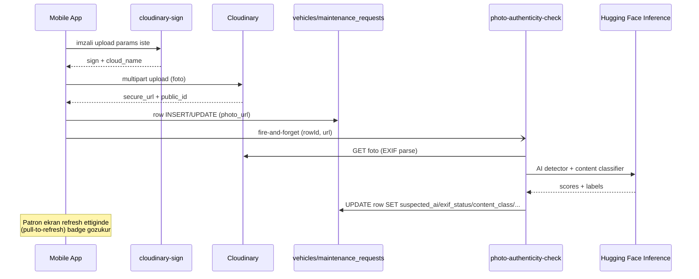

# DriverMesh — Mimari ve Çalışma Kılavuzu

> Bu doküman DriverMesh fleet uygulamasının nasıl çalıştığını, hangi bileşenlerden oluştuğunu, modüller arası akışı ve iş mantığını açıklar. Geliştiriciler ve **uygulamayı tanıyacak chatbot için tek-kaynak referansı**.
>
> **Tutum:** kullanıcı sorduğunda "DriverMesh nasıl bakıma alır", "şofor talep gönderince ne olur", "bir araç bakımdayken iş atanabilir mi" gibi sorulara doğru ve eksiksiz cevap verebilmek için yazıldı.

---

## 1. Genel Bakış

**DriverMesh**, küçük-orta ölçekli filo operasyonları için Türkiye odaklı bir mobil uygulamadır. Bir filo sahibi (Patron) yöneticileri ve şoförleri davet eder, araç envanterini yönetir, müşteri taşıma işlerini oluşturur ve atar. Şoförler atanan işleri kabul eder, başlatır ve tamamlar. Patron tüm filoyu canlı haritada görür, bakım taleplerini onaylar/reddeder, müşteri geri bildirimlerini email/push/Telegram üzerinden alır.

**Hedef kullanıcılar:** Türkiye'de 5-50 araçlık şehir-içi lojistik / kurye / nakliye filoları.

**Çekirdek değer önerisi:**
- Tek mobil app içinden filonun kim/nerede/ne yapıyor görünürlüğü
- Telegram/email ile müşteri geri bildirim entegrasyonu
- **Bakım yönetimi** — talep, onay/red, otomatik süre dolma, foto kanıtlama
- **Demo mode** — gerçek backend olmadan UI tanıtımı

**Roller (hiyerarşi):**

```
Patron (owner) ────► Yöneticiler (manager) ────► Şoförler (driver)
   1 tane             N tane (owner atar)         N tane (manager altında)
```

- Owner filoyu kuran; tüm yetkiler.
- Manager owner tarafından davet edilir; yetkileri owner verir, override edilebilir.
- Driver işleri kabul eder; bakım talebi açabilir; manager altına atanır (`profiles.manager_id`).

---

## 2. Teknoloji Yığını

| Alan | Seçim | Not |
|---|---|---|
| Framework | Expo SDK 54 (React Native 0.81) | new architecture (Fabric) açık |
| Routing | Expo Router 6 (file-based) | `app/` klasör yapısı = ekran ağacı |
| Backend | **Supabase** (PostgreSQL + Auth + Storage + Edge Functions) | RLS politikaları aktif |
| Background | **Supabase pg_cron** + `pg_net` | dakikalık zamanlanmış görevler |
| Object storage | **Cloudinary** (resim) | signed upload + admin destroy |
| Push notification | **Firebase Cloud Messaging (FCM v1)** | Android tamam, iOS sonra |
| State (auth) | React Context (`AuthProvider`) | session + profile + isDemo |
| State (formlar) | `react-hook-form` + `zod` validation | tüm input formları |
| i18n | `i18next` + `react-i18next` | TR/EN, locale `expo-localization` |
| Stil | `src/theme/index.ts` — koyu lacivert (#0A0E1F) + turuncu accent (#FF7A1A) | tema tek kaynak |
| Yazı tipi | Noto Sans (Google Fonts, OFL) | `Text.defaultProps.style` ile global |
| Harita | `react-native-maps` + Google Maps SDK | Maps API key build-time inject |
| İkonlar | `@expo/vector-icons` (Feather + MaterialCommunityIcons) | |
| Görsel cache | AsyncStorage tabanlı (`src/lib/imageCache.ts`) | Cloudinary URL → data URI |
| Foto picker | `expo-image-picker` (kamera + galeri) | Android 14 photo picker uyumlu |
| Bildirim listener | `expo-notifications` + `expo-device` | lazy-loaded; native modül yoksa graceful no-op |

---

## 3. Klasör Yapısı

```
drivermesh/
├── app/                          # Expo Router rotaları (file-based)
│   ├── _layout.tsx               # Root layout: AuthProvider + ConfirmProvider + AuthGate
│   ├── index.tsx                 # Initial redirect
│   ├── (auth)/                   # giriş yapılmamış kullanıcı ekranları
│   │   ├── welcome.tsx           # demo + login + register CTA + dil pill
│   │   ├── login.tsx
│   │   ├── register.tsx          # filo kuran owner kaydı
│   │   └── redeem.tsx            # davet kodu kullanma (driver/manager)
│   └── (app)/                    # giriş yapmış kullanıcı ekranları
│       ├── _layout.tsx           # bottom nav (Ana / İşler / Filo / Hesap)
│       ├── index.tsx             # Ana sayfa (home dashboard)
│       ├── notifications.tsx     # bildirim listesi
│       ├── fleet-map.tsx         # filo haritası
│       ├── reports.tsx           # özet rapor
│       ├── jobs/                 # iş yönetimi
│       │   ├── index.tsx         # iş listesi
│       │   ├── [id].tsx          # iş detay
│       │   ├── new.tsx           # yeni iş
│       │   ├── request.tsx       # şofor self-request iş
│       │   └── edit/[id].tsx     # iş güncelleme (owner/manager)
│       ├── vehicles/             # araç yönetimi
│       │   ├── index.tsx         # araç listesi
│       │   ├── [id].tsx          # araç detayı (+ bakım banner)
│       │   ├── new.tsx           # yeni araç (+ foto upload)
│       │   └── edit/[id].tsx     # araç düzenle (+ foto change/remove)
│       ├── maintenance/          # ★ bakım talepleri
│       │   ├── index.tsx         # talep listesi (Bekleyen / Tümü)
│       │   ├── [id].tsx          # talep detay (+ approve/reject/cancel)
│       │   └── new.tsx           # yeni bakım talebi formu
│       ├── team/
│       │   ├── index.tsx
│       │   └── invite.tsx
│       ├── permissions/
│       │   ├── index.tsx
│       │   └── [id].tsx
│       └── account/
│           ├── index.tsx         # hesap + yönetim entry'leri
│           ├── edit.tsx          # profil düzenle (+ avatar upload)
│           ├── hq.tsx            # filo merkezi (HQ) ayarları
│           ├── feedback.tsx      # müşteri geri bildirim kanalları
│           └── support.tsx       # destek formu (Telegram bot)
├── src/
│   ├── auth/
│   │   ├── AuthProvider.tsx
│   │   └── useCan.ts             # permission hook
│   ├── components/
│   │   ├── PhotoPicker.tsx       # ★ tek-foto picker (action sheet)
│   │   ├── MultiPhotoPicker.tsx  # ★ multi-foto picker (max 5, thumbnail strip)
│   │   ├── CachedImage.tsx       # AsyncStorage backed image cache
│   │   ├── JobMiniMap.tsx        # job detay mini harita
│   │   ├── LabelRenderPool.tsx   # off-screen ViewShot pool (harita pill render)
│   │   ├── MiniLocationPin.tsx   # pickup/dropoff teardrop pin
│   │   ├── ConfirmDialog.tsx     # branded confirm modal
│   │   ├── Toast.tsx
│   │   ├── Screen.tsx, Button.tsx, TextField.tsx, Card.tsx, Avatar.tsx, ...
│   ├── demo/
│   │   └── store.ts              # demo modu in-memory store + persist
│   ├── i18n/
│   │   ├── index.ts
│   │   └── locales/{tr,en}.ts    # tüm UI metinleri
│   ├── lib/                      # data layer (Supabase + isDemoActive guard)
│   │   ├── supabase.ts
│   │   ├── database.types.ts     # manuel + Supabase generate
│   │   ├── jobs.ts
│   │   ├── vehicles.ts
│   │   ├── maintenance.ts        # ★ bakım flow + push entegrasyon
│   │   ├── cloudinary.ts         # ★ uploadImage + destroyImage
│   │   ├── pushNotifications.ts  # ★ FCM token registration (lazy)
│   │   ├── permissions.ts
│   │   ├── queries.ts            # fleet map, reports
│   │   ├── feedback.ts           # owner feedback channel ayarları
│   │   ├── support.ts            # support form Telegram bot
│   │   ├── invitations.ts
│   │   ├── hq.ts
│   │   ├── imageCache.ts
│   │   └── openInMaps.ts         # iOS Apple Maps / Android Google Maps
│   └── theme/
├── android/                      # Expo prebuild (gitignored)
├── ios/                          # iOS native (gitignored)
├── assets/                       # logo, splash görselleri
├── google-services.json          # Firebase Android config (kök dizin)
└── docs/                         # bu klasör (ARCHITECTURE.md + TESTING.md)
```

---

## 4. Mimari Katmanlar

```
┌────────────────────────────────────────────────────┐
│  UI: app/ ekranları + src/components/             │  Sunum
├────────────────────────────────────────────────────┤
│  Data: src/lib/ (Supabase RPC + isDemoActive)     │  İş mantığı
├────────────────────────────────────────────────────┤
│  Source: Supabase (canlı) | demo store (mock)      │  Veri
└────────────────────────────────────────────────────┘
       │
       ▼ (Edge Functions, Cron, Storage)
┌──────────────────────────────────────────┐
│  Background: pg_cron, send-push,          │
│  cloudinary-sign/destroy, telegram-       │
│  dispatch, photo-authenticity-check,      │
│  maintenance_auto_checkout RPC            │
└──────────────────────────────────────────┘
```

**Kural:** UI katmanı `src/lib/*`'ı çağırır, doğrudan `supabase` client'a dokunmaz. Lib `isDemoActive()` ile demo store'a veya Supabase'e dağıtır. Demo modu UI için saydamdır.

```
JobDetailScreen (app/(app)/jobs/[id].tsx)
   │ getJob(id)
   ▼
src/lib/jobs.ts:getJob
   │
   ├─ if isDemoActive() → demo.jobById(id)
   └─ else            → supabase.from('jobs').select(...)
```

---

## 5. Auth, Profile ve Hiyerarşi

### Auth flow

1. `/(auth)/welcome` → seçimler:
   - **Demo App** → `signInDemo()` → `activateDemo()` → fake session → home
   - **Giriş Yap** → email+şifre → Supabase auth → session açıldı
   - **Filo Başlat** → register → filo kur (owner)
   - **Davet Kodum Var** → redeem → davet token doğrula → driver/manager olarak katıl
2. `AuthProvider` profile çeker (`fetchProfile`)
3. Session sahibi için **push token registration** (Android) tetiklenir (`registerForPushNotifications`)
4. `AuthGate` `(app)` namespace'ine yönlendirir

### Hiyerarşi (manager_id)

`profiles` tablosunda **`manager_id UUID`** sütunu var (Phase 1 migration). Doldurma kuralı:

| Rol | manager_id |
|---|---|
| owner | NULL |
| manager | NULL (manager doğrudan owner altında) |
| driver | bağlı olduğu manager'ın profile.id (NULL ise yetim driver) |

Davet sırasında manager seçilebilir: `invitations.manager_id` doldurulur, davet kabul edilirken `profiles.manager_id`'ye taşınır.

> **Phase 2 plan (henüz uygulanmadı):** RLS politikaları manager scope filtrelemesi (manager kendi şoforlerinin verisini görür, başka manager'lılarınkini görmez). Şu an flat — tüm org içindekiler birbirini görür.

---

## 6. Demo Modu

Demo modu **gerçek Supabase çağrısı yapmadan** uygulamanın canlı çalıştığı görüntüsünü verir.

**Aktivasyon:** Welcome → "Demo App" → `signInDemo()` → `activateDemo()`:
1. AsyncStorage'tan `drivermesh.demo.state.v2` anahtarını oku
2. Varsa hidrate et, yoksa `reseed()` ile seed verisini oluştur
3. `_active = true`, fake `Session` set et, home'a yönlendir

**Seed içeriği:**
- 1 owner ("Demo Patron"), 1 manager ("Selin Yöneten"), 3 driver (Ahmet, Mehmet, Ayşe — hepsi Selin'in altında manager_id=DEMO_MANAGER_ID)
- 5 araç (Ford Transit, Mercedes Sprinter, Volkswagen Crafter, Iveco Daily, Renault Master) — biri başlangıçta `maintenance` durumunda
- 7 demo job (open, assigned, in_progress, completed)
- 1 pending invitation (Kerem Aday, manager_id=DEMO_MANAGER_ID)
- 3 demo notification (driver_request, permission_grant, request_approved)

**State:** `src/demo/store.ts` modül-seviyesi singleton object (`state`). Her mutation `emit()` → 250ms debounced AsyncStorage'a yazma.

**Lib guard:** her data lib fonksiyonunun başında:
```ts
if (isDemoActive()) {
  return demo.something();
}
// supabase çağrısı
```

**Mutlak kural:** Demo aktifken **hiçbir şekilde Supabase'e gidilmez** — credential leak ve UI tutarlılığı için (`feedback_demo_no_supabase` memory).

---

## 7. Job (İş) Lifecycle

`jobs.status` enum: `open | assigned | in_progress | completed | failed | cancelled`.

```
[Owner/Manager creates] ─► open
                           │
                  reassignJob(driverId)
                           ▼
                       assigned
                           │
                       startJob (driver)
                           ├─ vehicle.is_at_hq = false (otomatik)
                           ▼
                      in_progress
                           │
                  completeJob / failJob (driver)
                           ▼
                  completed | failed

[Owner cancels at any non-terminal state] ─► cancelled
```

**Self-request:** Driver `jobs/request.tsx` ile `source: 'driver_request'` yeni bir job oluşturur (status `open`). Owner/manager `approveDriverRequest` (driver'a atar) veya `rejectDriverRequest` ile karara bağlar.

**Edit:** Sadece owner/manager + `jobs.update_any` izniyle. Edit ekranı `app/(app)/jobs/edit/[id].tsx`. Düzenlenebilir alanlar: customer_name, pickup/dropoff (adres + koordinat), driver_id (reassign), notes. **KM ve ETA kullanıcıdan alınmaz** — süre işin başlat-bitir farkından, mesafe Google Directions maliyetli olduğu için saklanmaz.

**Notification yan etkileri:**
| Olay | Tip | Hedef |
|---|---|---|
| reassignJob driverId değişti | `job_assigned` | yeni driver |
| cancelJob (atanmış driver var) | `job_cancelled` | driver |
| approveDriverRequest | `request_approved` | driver |
| rejectDriverRequest | `request_rejected` | driver |
| updateJob (atanmış driver var) | `job_update` | driver (changed_fields payload'da) |

Push notification: bu tipler `notifyDriverEvent` helper'ı içinde `supabase.functions.invoke('send-push')` ile FCM'a gönderilir (best-effort).

---

## 8. Vehicle (Araç) Yönetimi

`vehicles` tablo kolonları (özet):
- Temel: `plate`, `brand`, `model`, `year`, `status`, `color` (operatör hex), `photo_url`
- Konum: `is_at_hq` (parked at HQ)
- Bakım state: `maintenance_until`, `maintenance_started_at`, `maintenance_started_by`, `maintenance_reason`, `maintenance_photo_urls TEXT[]`

**Status:** `active | idle | maintenance`. **Önemli kural:** UI'dan **manuel status değişimi YOKTUR** (kullanıcı tercihi). Status DB-side flip'lenir:
- Job lifecycle (start/complete) → vehicle.is_at_hq trigger
- Bakım flow (approve → maintenance, end → idle)

**Yeni araç:** `app/(app)/vehicles/new.tsx`. PhotoPicker + plaka + marka + model + yıl + (opsiyonel) renk swatch.

**Düzenle:** `app/(app)/vehicles/edit/[id].tsx`. Foto change/remove + plaka, marka, model, yıl, renk. Status edit edilemez. `vehicles.update` izni gerek.

**HQ marker:** `is_at_hq=true` aracı haritada gizler (HQ ikonu zaten orada). DB trigger ile dispatch'te otomatik clear.

---

## 9. Vehicle Photo Upload

`PhotoPicker` component (`src/components/PhotoPicker.tsx`) ortak picker UI'ı sağlar:
- Ratio-based preview (default 16:10 vehicle, 1:1 avatar gibi konfigüre)
- Tap → action sheet (Kamera / Galeri / İptal)
- Foto seçilince: parent'a callback ile URI verir (upload yapmaz)
- Re-pick + remove butonları

**Vehicles new akışı:**
1. Form üstünde `PhotoPicker` (16:10)
2. Kullanıcı foto seçer → `photoUri` state set
3. Submit'te (varsa): `uploadImage(uri, 'drivermesh/{org_id}/vehicles', { tags: ['vehicle'] })` → Cloudinary signed upload → `secureUrl` döner → `createVehicle({ photoUrl: secureUrl })`

**Vehicles edit akışı:**
1. `originalPhotoUrl = vehicle.photo_url` saklanır
2. Kullanıcı foto değiştirir/kaldırır → `photoUri` state değişir
3. Submit'te: `photoUri !== originalPhotoUrl` ise:
   - Yeni foto varsa: `uploadImage` → yeni `secureUrl`
   - Eski foto varsa: `publicIdFromUrl(originalPhotoUrl)` → `destroyImage(publicId)` (best-effort, async)
   - `updateVehicle({ photoUrl: newSecureUrl ?? null })`

**Demo path:** `cloudinary.uploadImage` `isDemoActive()` durumunda Cloudinary'e gitmez, gelen `data:image/...` URI'yi olduğu gibi DB'ye yazar (vehicle.photo_url). `destroyImage` no-op. Vehicle render `<Image source={{ uri: dataUri }} />` ile çalışır.

---

## 10. Maintenance (Bakım) Flow ⭐

Tam akış memory dosyasında ([`project_maintenance_flow.md`](../../.claude/memory/project_maintenance_flow.md)) sabitlenmiş kullanıcı kararlarına göre tasarlandı.

### 10.1 Veri modeli

`maintenance_requests` tablosu:
| Kolon | Tip | Not |
|---|---|---|
| id | UUID PK | |
| organization_id | UUID FK | |
| vehicle_id | UUID FK | |
| requester_id | UUID FK profiles | talep açan |
| reason | TEXT NOT NULL | min 3 char (CHECK + zod) |
| photo_urls | TEXT[] DEFAULT '{}' | Cloudinary secure_url'ler |
| estimated_minutes | INT NULL | NULL = belirsiz, otomatik checkout calismaz |
| status | TEXT CHECK | `pending\|approved\|rejected\|expired\|cancelled` |
| decided_by | UUID FK profiles NULL | |
| decided_at | TIMESTAMPTZ NULL | |
| rejection_reason | TEXT NULL | status=rejected ise NOT NULL (CHECK) |
| requested_at | TIMESTAMPTZ DEFAULT NOW() | |

`vehicles` tablosuna eklenen bakım state kolonları (onay sonrası set edilir):
- `maintenance_until TIMESTAMPTZ NULL` — bakım bitiş tahmini
- `maintenance_started_at TIMESTAMPTZ NULL`
- `maintenance_started_by UUID FK profiles NULL`
- `maintenance_reason TEXT NULL`
- `maintenance_photo_urls TEXT[] NOT NULL DEFAULT '{}'`

### 10.2 Permission anahtarları

| Anahtar | Default Owner | Default Manager | Default Driver | Açıklama |
|---|---|---|---|---|
| `vehicles.send_to_maintenance` | true | true | true | Talep açma |
| `vehicles.approve_maintenance` | true | true | **false** | Onay verme (kritik) |

Permission resolver (`src/lib/permissions.ts:checkPermission`) demo'da `profile.role === 'owner'` ise her zaman true. Production'da `has_permission(p_user_id, p_key)` RPC.

### 10.3 Kullanıcı kararları (memory'den)

1. **Onay yetkisi:** Default patron. Yöneticilere izin verilebilir. Bir kere onay yeterli (re-approval gerekmez).
2. **Otomatik onay/checkout:** `maintenance_until` dolduktan sonra sistem otomatik idle yapar (pg_cron her dakika).
3. **Şofor onay yetkisi durumu:** Eğer şofora `vehicles.approve_maintenance=true` set edilirse, talep INLINE auto-approve olur. Kimseye onay bildirimi gitmez; sadece **"Araç X şu sebeple bakıma sokuldu"** bildirimi yöneticilere gider.
4. **Aktif iş kontrolü:** Aracın `assigned` veya `in_progress` işi varsa bakıma alınamaz. UI ile lib aynı kuralı uygular (`vehicleHasActiveJob`).
5. **Foto:** Opsiyonel. **Multi-photo** (max 5, `MultiPhotoPicker`).
6. **Bakım sebebi:** Serbest metin. Enum yok. Sadece sebep + opsiyonel foto.
7. **Çoklu talep:** Bir araca birden fazla pending talep açılabilir. Şofor müsaitse alır; iş bitince diğer açık talep `maintenance_pending_reminder` ile hatırlatılır.
8. **Red durumu:** Açıklama **ZORUNLU** (CHECK). Talep açana `maintenance_rejected` notification + reason payload'da.
9. **Teslim alma yetkisi:** **Herkese açık** (org içindeki tüm aktif kullanıcılar).

### 10.4 Akış: createMaintenanceRequest

```ts
src/lib/maintenance.ts:createMaintenanceRequest({
  organizationId, vehicleId, requesterId, reason, photoUrls?, estimatedMinutes?
}): Promise<MaintenanceRequestWithRefs>
```

Adımlar:
1. Reason trim, boş ise `MaintenanceError('reason_required')`
2. `vehicleHasActiveJob(vehicleId)` — `assigned\|in_progress` job varsa `MaintenanceError('active_job')`
3. `autoApprove = checkPermission(requesterId, 'vehicles.approve_maintenance')`
4. `INSERT maintenance_requests` (status='pending' veya 'approved' eğer auto)
5. `autoApprove === true` ise:
   - `applyVehicleMaintenanceState({ ... maintenance_until = startedAt + estimatedMinutes })`
   - `notifyManagers(orgId, requesterId, 'maintenance_started', { plate, reason, auto: true })` — yöneticilere bildiri
6. `autoApprove === false` ise:
   - `notifyManagers(orgId, requesterId, 'maintenance_requested', { requestId, plate, reason })`

### 10.5 Akış: approveMaintenanceRequest

```ts
approveMaintenanceRequest(requestId, deciderId): Promise<void>
```

1. Request fetch + status 'pending' kontrolü (yoksa `not_pending` error)
2. Aktif iş kontrolü (race-protect)
3. UPDATE status='approved', decided_by, decided_at WHERE status='pending' (race-safe)
4. `applyVehicleMaintenanceState` — vehicle status='maintenance', durations
5. `notifyOne(requester_id, 'maintenance_approved', { plate, reason })`
6. `notifyManagers(orgId, deciderId, 'maintenance_started', { plate, reason }, extraExclude=[requester_id])`
   — requester eğer manager ise double-notif önleme

### 10.6 Akış: rejectMaintenanceRequest

```ts
rejectMaintenanceRequest(requestId, deciderId, rejectionReason): Promise<void>
```

1. Reason trim + boş kontrolü (`rejection_reason_required`)
2. Status 'pending' kontrolü
3. UPDATE status='rejected', decided_by, decided_at, rejection_reason
4. **Cloudinary cleanup:** her `photo_urls[i]` için `destroyImage(publicIdFromUrl(url))` (best-effort)
5. `notifyOne(requester_id, 'maintenance_rejected', { plate, reason, rejectionReason })`

### 10.7 Akış: cancelMaintenanceRequest

```ts
cancelMaintenanceRequest(requestId, requesterId): Promise<void>
```

Talep eden kendi pending talebini geri çeker. Status='pending' + requester_id match WHERE clause. Foto'lar Cloudinary'den temizlenir. Notif yok (talep eden zaten farkında).

### 10.8 Akış: endMaintenance

```ts
endMaintenance(vehicleId, endedBy, opts?: { auto?: boolean }): Promise<void>
```

"Bakımdan Çıkar" buton (banner'da) veya cron'dan tetiklenir.

1. Vehicle fetch (`vehicles` row)
2. UPDATE: status='idle', maintenance_* alanlar NULL/{}
3. **Cloudinary cleanup:** her `vehicle.maintenance_photo_urls[i]` için `destroyImage` (best-effort)
4. `notifyOrg(orgId, endedBy, 'maintenance_ended', { plate, auto })` — tüm fleet'e
5. `remindPendingRequesters(orgId, vehicleId, endedBy, plate)` — bu araç için pending talep varsa, talep edenlere `maintenance_pending_reminder` (memory karar 7)

### 10.9 Auto-checkout (pg_cron)

`maintenance_auto_checkout()` RPC, **her dakika** `cron.schedule` ile çağrılır. Logic:

1. `vault.decrypted_secrets WHERE name='anon_key'` → anahtar oku (yoksa push/cleanup atla, in-app notif yine yaz)
2. `SELECT ... FROM vehicles WHERE status='maintenance' AND maintenance_until < NOW()` cursor
3. Her overdue araç için:
   - UPDATE vehicle reset (status='idle', maintenance_* sıfırla)
   - Yöneticilere INSERT `maintenance_overdue` notification + `extensions.http_post('send-push', ...)` (anon_key Bearer)
   - Her `maintenance_photo_urls[i]` için `cloudinary_public_id_from_url(url)` → `extensions.http_post('cloudinary-destroy', ...)`
4. Affected count return

`cloudinary_public_id_from_url(text)` helper RPC: regex `'/upload/(?:v\d+/)?(.+?)(?:\.[^./]+)?$'`.

### 10.10 UI ekranları

| Ekran | Kim erişir | Ne yapar |
|---|---|---|
| `vehicles/[id]` Bakım Banner | herkes | "Bakımda" pill + sebep + foto thumbnail + "Bakımdan Çıkar" buton |
| `vehicles/[id]` "Bakıma Al" trigger | `vehicles.send_to_maintenance` + !hasActiveJob | sarı outline buton — yeni talebe götürür |
| `maintenance/new` | `vehicles.send_to_maintenance` | form: sebep + multi-foto + tahmini süre |
| `maintenance/index` (Bakım Talepleri) | `account` Yönetim section'dan | tab: Bekleyen / Tümü |
| `maintenance/[id]` | herkes (org) | detay + (approve/reject) eğer yetkili pending'de |

### 10.11 Notification tipleri (özet)

| Tip | Kim alır | Tetikleyici |
|---|---|---|
| `maintenance_requested` | yöneticiler | createMaintenanceRequest (auto-approve değilse) |
| `maintenance_approved` | talep eden | approveMaintenanceRequest |
| `maintenance_rejected` | talep eden | rejectMaintenanceRequest (rejectionReason payload'da) |
| `maintenance_started` | yöneticiler | onaylanan/auto-approved her durumda |
| `maintenance_ended` | tüm org | endMaintenance |
| `maintenance_overdue` | yöneticiler | pg_cron auto-checkout |
| `maintenance_pending_reminder` | talep eden | endMaintenance sonrası diğer pending varsa |

---

## 11. Fleet Map (Filo Haritası)

`app/(app)/fleet-map.tsx` filoyu canlı (refresh ile) gösterir.

**Veri kaynağı:** `fetchFleetMap(orgId)` (`src/lib/queries.ts`):
- HQ koord + adres
- Tüm araçlar (plaka, status, color, is_at_hq, position)
- Aktif işler (assigned + in_progress) — her aracın `activeJob` olarak inject

**Render:**
- `LabeledMarker` (plaka pill) — vehicle başına. Pill arka rengi `v.color ?? vehicleColorFromPlate(v.plate)`.
- `LabelRenderPool` off-screen ViewShot ile pill'leri PNG render eder, `<Marker imageUri="...">` kullanır (Android performans).
- Pill arka rengi açık (white/yellow/silver) ise text + ikon SİYAH (luminance > 0.6 eşiği) — `pickContrastingFg` helper.
- `MiniLocationPin` — pickup/dropoff teardrop (ortası beyaz delik). Aktif işler için.
- `Polyline` — pickup→dropoff arası kesik çizgi, **vehicle renginin koyusu** (`darken()` helper).
- HQ — özel `LabeledMarker variant='hq'` (lavender renk).

**Marker tap dispatch (`onMarkerPress`):**

| Identifier | Aksiyon |
|---|---|
| `v:${vehicleId}` | `/(app)/vehicles/${id}` (vehicle detayı) |
| `hq` | `openInMaps(hq.lat, hq.lng, address)` (sistem haritası) |
| `p:${vehicleId}` | `openInMaps(pickup, address)` |
| `d:${vehicleId}` | `openInMaps(dropoff, address)` |

Vehicle pill tap'i hep router push (detay daha çok bilgi). Pickup/dropoff/HQ pin'leri sistem haritasına gider (yön tarifi).

---

## 12. JobMiniMap (Job Detay Haritası)

`src/components/JobMiniMap.tsx` — job detayında pickup/dropoff'u gösteren küçük statik harita.

- Polyline pickup→dropoff kesik kırmızı çizgi
- Pickup ve dropoff `MiniLocationPin` (teardrop, ortası delik)
- Vehicle pin (turuncu disc + araba ikonu) `inProgressStartedAt` set ise animasyonla yola oturur (28sn cycle, 120ms tick)
- Pin tap → `openInMaps`

---

## 13. Notifications (in-app)

`notifications` tablosu DB-driven event store. UI ekranı `app/(app)/notifications.tsx`.

**Tip listesi (`type` kolonu):**

| Tip | Tetikleyen | Hedef | Deep-link |
|---|---|---|---|
| `permission_grant` | Owner permission değişikliği | İlgili member | category routes |
| `driver_request` | Driver self-request job | Owner+manager | `/(app)/jobs/{job_id}` |
| `request_approved` | Owner approves driver request | Driver | jobs |
| `request_rejected` | Owner rejects | Driver | jobs |
| `job_assigned` | reassign new driver | Driver | jobs |
| `job_cancelled` | cancelJob (driver atanmış) | Driver | jobs |
| `job_update` | updateJob (changed_fields) | Driver | jobs |
| `maintenance_requested` | createMaintenanceRequest (pending) | Yöneticiler | `/(app)/maintenance/{requestId}` |
| `maintenance_approved` | approve | Talep eden | maintenance |
| `maintenance_rejected` | reject | Talep eden | maintenance |
| `maintenance_started` | onay sonrası | Yöneticiler | maintenance veya vehicle |
| `maintenance_ended` | endMaintenance | Tüm org | vehicle |
| `maintenance_overdue` | pg_cron auto | Yöneticiler | vehicle |
| `maintenance_pending_reminder` | endMaintenance sonrası | Talep eden | maintenance |

**Renderer:** her tip için title/body i18n string + payload (job_id, customer_name, plate, vehicleId, requestId, rejectionReason, ...). Tap → `router.push` deep-link.

**Yan etki tetikleyicileri:**
- `src/lib/jobs.ts:notifyDriverEvent` — single recipient + push (insert lib'de, send-push `persist:false`)
- `src/lib/maintenance.ts:notifyOne / notifyManagers / notifyOrg` — single/çoklu recipient + push (aynı pattern)
- **Cron path** (`maintenance_auto_checkout` RPC): send-push'u **`persist` belirtmeden** çağırır → v3 hem DB'ye insert hem push atar (tek atımda)

---

## 14. Push Notifications (FCM)

### 14.1 Stack

- Android: **Firebase Cloud Messaging (FCM v1)** — direkt FCM token, expo-notifications ile alınır
- iOS: APNs key + Firebase iOS app gerekiyor — şu an pasif
- Server: Supabase Edge Function `send-push` (FCM v1 OAuth2 + jwt-bearer)

### 14.2 Client tarafı (`src/lib/pushNotifications.ts`)

`registerForPushNotifications(userId)`:

1. `isDemoActive()` ise no-op
2. `Platform.OS === 'ios'` ise no-op (henüz)
3. `expo-device` ve `expo-notifications` modüllerini **lazy-load** et — native modül yoksa graceful skip
4. Permissions (granted değilse request)
5. Android default channel oluştur (`importance: HIGH`, vibration, lightColor)
6. `getDevicePushTokenAsync()` → FCM token
7. `UPDATE profiles SET push_token, push_platform, push_token_updated_at`

`clearPushToken(userId)` — sign-out'ta token temizler.

**AuthProvider entegrasyonu:** `useEffect` initial session resolve + `onAuthStateChange` ile her session geçişinde register tetiklenir.

### 14.3 Server tarafı (`send-push` Edge Function v3)

İmza: `POST /functions/v1/send-push` (verify_jwt: true)
```json
{
  "recipient_id": "uuid",
  "type": "string",
  "title": "string",
  "body?": "string",
  "data?": {...},
  "persist?": "boolean (default: true)"
}
```

Logic:
1. JWT auth check (Supabase verify_jwt:true)
2. `FCM_SERVICE_ACCOUNT_JSON` kaynak sırası:
   - `Deno.env.get('FCM_SERVICE_ACCOUNT_JSON')`
   - fallback `public.get_vault_secret('fcm_service_account_json')`
3. Service role ile profile fetch — `id, organization_id, push_token, push_platform`
4. **In-app persistence (yeni — v3):** `body.persist !== false` ise `public.notifications` tablosuna satır insert eder:
   - `organization_id` profiles'tan otomatik
   - `actor_id` = `body.data.actor_id` (string ise) veya `null`
   - `type`, `payload = body.data ?? {}`
   - Insert id'si yanıta `notification_id` olarak konur ve FCM data payload'una eklenir (deep-link için)
5. `push_token` yoksa erken dönüş: `{ ok:true, sent:0, skipped:1, reason:'no_token', notification_id }` (insert yapıldıysa ID döner)
6. JWT-bearer OAuth2 → FCM access token (1h cache)
7. POST `https://fcm.googleapis.com/v1/projects/{project_id}/messages:send` body:
```json
{
  "message": {
    "token": "...",
    "notification": { "title": "...", "body": "..." },
    "data": { "type": "...", "notification_id": "<insert-id-eger-persist-edildiyse>", ... },
    "android": { "priority": "HIGH", "notification": { "channel_id": "default" } }
  }
}
```
8. UNREGISTERED 404 → `UPDATE profiles SET push_token=NULL` (sileride çağrılmasın)

### 14.4 Çağrı noktaları ve `persist` kuralı

| Tetikleyici | `persist` | Sebep |
|---|---|---|
| `src/lib/jobs.ts:notifyDriverEvent` | **`false`** | Lib zaten `notifications` insert ediyor; send-push'tan ikinci kayıt istenmiyor |
| `src/lib/maintenance.ts:notifyOne` | **`false`** | Aynı sebep |
| `maintenance_auto_checkout` cron (pg_net) | default (`true`) | Cron yolu insert yapmıyor, send-push tek noktada hem persist hem push |
| Doğrudan curl/PowerShell test | default (`true`) | Manual test'lerde app içi listede de görünmesi için |

**Bu mantık neden gerekli?** Önceki v2'de send-push sadece FCM'e push atıyordu; cron yolundan gönderilen `maintenance_overdue` benzeri push'lar uygulama içi bildirim listesinde **görünmüyordu** (banner gelip kayboluyor, geçmiş kalmıyordu). v3 ile her push aynı zamanda DB'ye kayıt düşüyor; lib path'ler `persist:false` ile duplicate'ı engelliyor.

### 14.5 Setup gereksinimleri

| Adım | Kim | Nasıl |
|---|---|---|
| Firebase project + Android app | User | google-services.json kök dizine, app.json'da `android.googleServicesFile` |
| FCM service account JSON | User | Firebase Console → Service Accounts → Generate key → Supabase Edge Function Secrets'a `FCM_SERVICE_ACCOUNT_JSON` adıyla |
| anon_key vault | User | Supabase SQL: `SELECT vault.create_secret('<anon_key>', 'anon_key');` |
| Yeni APK build | User | `npx expo run:android` (expo-notifications native modülü için) |

---

## 15. Permissions Sistemi

`src/lib/permissions.ts` + `app/(app)/permissions/[id].tsx`.

**Catalog (14 anahtar):**
- `vehicles.view`, `vehicles.create`, `vehicles.update`, `vehicles.delete`
- `jobs.view`, `jobs.create`, `jobs.assign`, `jobs.update_any`, `jobs.cancel`
- `members.invite`, `members.remove`
- `reports.view`
- `vehicles.send_to_maintenance`, `vehicles.approve_maintenance` ★

**Tablolar:**
- `permission_keys` — katalog (key, category, is_critical, label_tr/en, sort_order)
- `role_default_permissions` — her rol için default
- `permission_overrides` — owner per-member override (member × key → allowed)

**RPC: `has_permission(p_user_id, p_key) → BOOLEAN`** override'ı varsa onu, yoksa role default'u döner.

**Hook:** `useCan('jobs.create')` → `{ allowed, reason }`. UI'da disable + tooltip.

**Demo path:** owner her zaman true. Diğer roller `ROLE_DEFAULTS` + `state.permissionOverrides` map'inden.

---

## 16. Cloudinary Pipeline

### 16.1 Konfigürasyon

| Var | Değer/Anlam |
|---|---|
| Cloud name | `dotcw6tty` |
| Folder convention | `drivermesh/{org_id}/{kategori}` (vehicles, maintenance, ...) |
| Auth | API_KEY + API_SECRET (Edge Function Secrets) |
| Client lib | `src/lib/cloudinary.ts` |

### 16.2 Edge Functions

**`cloudinary-sign`** — POST signed upload params:
```ts
body: { folder, public_id?, tags? }
→ { signature, timestamp, api_key, cloud_name, folder, public_id?, tags?, upload_url }
```
Folder must start with `drivermesh/` (cross-tenant koruma).

**`cloudinary-destroy`** — POST destroy:
```ts
body: { public_id, resource_type? = 'image' }
→ { result: 'ok'|'not found'|'error', cloudinary }
```
Public_id must start with `drivermesh/` (cross-tenant koruma).

### 16.3 Client API (`cloudinary.ts`)

```ts
uploadImage(uri, folder, opts?: { publicId?, tags?, mimeType? }): Promise<{ secureUrl, publicId }>
destroyImage(publicId): Promise<void>
publicIdFromUrl(url): string | null  // regex extract
```

**Demo path:** uploadImage data URI'yi olduğu gibi return eder, fake `publicId = ${folder}/demo-${Date.now()}`. destroyImage no-op.

### 16.4 Production akış

1. Client `supabase.functions.invoke('cloudinary-sign', { body: { folder, ... } })`
2. Sign yanıtı ile `FormData` oluştur (file + signature + api_key + ...)
3. `POST upload_url` Cloudinary'e direkt — yanıt `secure_url, public_id`
4. DB'ye `secure_url` yazılır (vehicle.photo_url, maintenance.photo_urls vb.)

Silme akışı (DB tarafı boşaltılırken):
1. `publicIdFromUrl(secureUrl)` → public_id
2. `supabase.functions.invoke('cloudinary-destroy', { body: { public_id } })`

Cron tarafı (pg_net üzerinden):
- `maintenance_auto_checkout` RPC içinde `extensions.http_post` ile aynı endpoint'e POST.

---

## 17. Auto-Checkout Cron

### 17.1 Setup

```sql
CREATE EXTENSION pg_cron;
CREATE EXTENSION pg_net WITH SCHEMA extensions;

-- pg_cron schedule: her dakika
SELECT cron.schedule(
  'maintenance-auto-checkout',
  '* * * * *',
  $$SELECT public.maintenance_auto_checkout();$$
);
```

### 17.2 RPC: `maintenance_auto_checkout()`

Yukarıda 10.9'da detaylı.

**Akış:**
1. vault'tan `anon_key` oku (yoksa graceful skip push/cleanup)
2. Overdue araçları cursor ile dön
3. Vehicle reset
4. Yöneticilere in-app notification insert + send-push (pg_net)
5. Her foto için cloudinary-destroy (pg_net)

### 17.3 Çağrı log'u

```sql
SELECT * FROM cron.job_run_details
WHERE jobid = (SELECT jobid FROM cron.job WHERE jobname='maintenance-auto-checkout')
ORDER BY start_time DESC LIMIT 10;
```

`status='succeeded'` + `return_message='1 row'` (RPC her zaman bir set döner).

---

## 18. Internationalization (i18n)

`src/i18n/locales/{tr,en}.ts` — tüm UI metinleri burada. `useTranslation()` ile.

**Locale tespit:** ilk açılışta `expo-localization.getLocales()` cihaz dilinden TR/EN seç. Kullanıcı manuel toggle ederse `AsyncStorage('drivermesh.locale')` kalıcı.

**Title case kuralı:** kısa display string'ler "Title Case" formatında ("Filon Hareket Halinde"), uzun cümleler sentence case (".....").

Locale dosyaları yapısı (üst düzey namespace'ler):
- `auth`, `home`, `vehicles`, `jobs`, `team`, `permissions`, `account`, `notifications`, `feedback`, `support`
- `errors`, `common`, `photoPicker`
- **`maintenance`** (new/detail/list/banner/actions/notification)

---

## 19. Theme & UI Kit

`src/theme/index.ts`:
- Renkler: `bg`, `bgElevated`, `surface`, `text`, `textMuted`, `accent` (#FF7A1A), `mesh` (mavi-mor), `success`, `danger`, `warning`, `lavender`, `accentMuted`, `dangerMuted`, `border`
- Spacing scale: xs..3xl
- Radius: sm..xl..full (999)
- Font: NotoSans + size scale (xs..4xl) + weight (regular/medium/semibold/bold)

**Paylaşılan komponentler (`src/components/`):**

| Komponent | Açıklama |
|---|---|
| `Button` | leftIcon, variant (primary/secondary/ghost), loading, fullWidth |
| `Card` | rounded surface container |
| `TextField` | label + icon + multiline + error display |
| `Picker` | dropdown list selector |
| `Avatar` | uri + initials fallback + cached |
| `ConfirmDialog` (provider) | branded confirm — `useConfirm()` hook |
| `Toast` (provider) | `useToast().success/error/warning` |
| `Screen` | page wrapper (scroll, padding) |
| `MeshBackground` | decorative bg (lacivert mesh ağ) |
| `CachedImage` | URL → AsyncStorage data URI |
| `Logo`, `WelcomeHero` | branding components |
| `PhotoPicker` ★ | tek-foto picker (action sheet + remove) |
| `MultiPhotoPicker` ★ | multi-foto picker (max param + thumbnail strip) |
| `JobMiniMap` | job detay küçük harita |
| `LabelRenderPool` | off-screen ViewShot pool (harita pill PNG) |
| `MiniLocationPin` | pickup/dropoff teardrop pin |

---

## 20. Cross-cutting Konular

### Image Cache Pipeline
Cloudinary URL → AsyncStorage data URI cache. `<CachedImage uri={url} />`. İlk fetch'te bytes indir + base64 encode + persist. Sonraki render'larda data URI direkt yüklenir.

### Demo State Persistence
Demo store her mutation'da 250ms debounced disk yazma (`drivermesh.demo.state.v2` AsyncStorage key).

### Native Maps Integration
`src/lib/openInMaps.ts` helper: iOS `maps://`, Android `geo:`, web `https://www.google.com/maps/...`.

### AuthGate Mount Race
Fresh start sonrası Expo Router'ın internal state mount tamamlanmadan `router.replace` çağrılırsa "Attempted to navigate before mounting the Root Layout" hatası tetikleniyordu. `useRootNavigationState()?.key` guard + try/catch silent fail ile çözüldü ([fleet/app/_layout.tsx](../../fleet/app/_layout.tsx)).

### Master-only Workflow
Bu projede tüm commit'ler `master` branch'ine gider. Feature branch açılmaz (kullanıcı tercihi). Permission rule sırasında onay alınır.

---

## 21. Ortam Değişkenleri (.env)

```
# Supabase
EXPO_PUBLIC_SUPABASE_URL=https://ucitxvsndlwvvnqwabgo.supabase.co
EXPO_PUBLIC_SUPABASE_ANON_KEY=eyJ...

# Cloudinary
EXPO_PUBLIC_CLOUDINARY_CLOUD_NAME=dotcw6tty
CLOUDINARY_API_KEY=...           # Edge Function Secrets
CLOUDINARY_API_SECRET=...        # Edge Function Secrets

# Maps
EXPO_PUBLIC_GOOGLE_MAPS_API_KEY_ANDROID=...
EXPO_PUBLIC_GOOGLE_MAPS_API_KEY_IOS=...

# Push (Android)
EXPO_PUBLIC_FCM_SENDER_ID=828815055730
# Server only:
# FCM_SERVICE_ACCOUNT_JSON=...    # Edge Function Secrets

# Telegram support bot
EXPO_PUBLIC_TELEGRAM_SUPPORT_USERNAME=...
EXPO_PUBLIC_TELEGRAM_SUPPORT_API_KEY=...
EXPO_PUBLIC_TELEGRAM_SUPPORT_CHAT_ID=...
```

`EXPO_PUBLIC_` ön ekiyle olanlar client bundle'a embed edilir (anon key dahil — RLS güvenliği yeterli). Sırtta tutulan secret'lar (CLOUDINARY_API_SECRET, FCM_SERVICE_ACCOUNT_JSON) **sadece Supabase Edge Function Secrets'ta**, client'a sızmaz.

**Maps API key güvenliği:** Google Cloud Console'da:
- Android key → Application Restriction = "Android apps" + package + SHA-1 fingerprint
- iOS key → Application Restriction = "iOS apps" + bundle ID
- API restriction = sadece "Maps SDK for Android/iOS"

**Supabase Vault:**
```sql
SELECT vault.create_secret('<anon_key>', 'anon_key');
```
pg_cron RPC'leri vault'tan okur.

---

## 22. Edge Functions (Supabase)

| Slug | verify_jwt | Açıklama |
|---|---|---|
| `cloudinary-sign` | true | Signed upload params üretir; folder `drivermesh/` enforce |
| `cloudinary-destroy` | true | Public_id ile asset siler; aynı folder kuralı |
| `send-push` | true | FCM v1 API ile push — service account JWT-bearer OAuth2 |
| `send-support-message` | true | In-app destek formu → Telegram admin chat |
| `telegram-dispatch` | true | Müşteri feedback Telegram bot |
| `photo-authenticity-check` | true | **3-katmanli foto dogrulama** — EXIF DateTimeOriginal kontrolu + Hugging Face AI-detector + content classifier (vehicle vs non-vehicle). DB'ye suspected_ai/ai_score/exif_status/content_class yazar (bkz. §22a) |
| `maintenance-cron` | false | pg_cron tarafindan dakikalik tetiklenir; maintenance_until past olan araclari idle'a aldirir + push gonderir |
| `bootstrap-vault` | true | Vault'ta saklanan anon_key'i SECURITY DEFINER ile servisleyen tek seferlik bootstrap fn |
| `directions` | true | (legacy) eski rota cache — silinmesi planlandi |

Tümü `import 'jsr:@supabase/functions-js/edge-runtime.d.ts';` ile Deno runtime.

---

## 22a. Photo Authenticity (3-katmanli foto dogrulama)

**Sorun:** Filo bakim ve arac fotolarinda sahte foto (AI-uretilmis, internetten indirilmis, eski/yeniden kullanilmis) riski. Patron'in onay surecini guvenli kilmak gerekiyor.

**Cozum:** `photo-authenticity-check` edge function (v7) bir foto URL'i geldiginde 3 paralel kontrol calistirir, sonuclari `vehicles` veya `maintenance_requests` row'una yazar. Client tarafi bayrakli bir Patron-only badge gosterir.

### 3 katman

1. **EXIF DateTimeOriginal** — Cloudinary'den indirilen JPEG'in EXIF metadatasini parse et:
   - `exif_status='valid'` — DateTimeOriginal var ve son 30 gun icinde
   - `exif_status='missing'` — EXIF yok (screenshot/internet indirme/format dönüsturme)
   - `exif_status='stale'` — DateTimeOriginal var ama 30+ gun eski (yeniden kullanim sinyali)
2. **Hugging Face AI-detector** — `umm-maybe/AI-image-detector` model'i ile inference (`HF_TOKEN` env'inde, free tier). Sonuc: `suspected_ai: boolean`, `ai_score: 0..1`.
3. **Content classifier** — `google/vit-base-patch16-224` veya esitleri ile generic image classification:
   - `content_class='vehicle'` — top-1 label arac kategorisi (sedan, suv, truck, minivan, sports_car, vs.)
   - `content_class='non_vehicle'` — yanlis icerik (selfie, kedi, jersey, dokuman)
   - `content_top_label`, `content_score` debug ve UI label gostermek icin

### Badge sirasi (oncelik)

`badgeFromSummary()` (src/lib/photoAuthenticity.ts) priority:

```
wrong_content     (content_class='non_vehicle')  →  KIRMIZI banner — onerme kabul etme
ai_generated      (suspected_ai=true)             →  SARI banner — sorgulayarak onayla
exif_missing      (exif_status='missing')         →  GRI banner — bilgi
exif_stale        (exif_status='stale')           →  GRI banner — bilgi
null              hepsi temiz                     →  badge yok
```

### Akis



### Demo coverage

`src/demo/store.ts` 4 maintenance_request seed'i ile 4 badge senaryosunu kapsar:
- `demo-mr-pending` → `ai_generated`
- `demo-mr-rejected` → `wrong_content`
- `demo-mr-cancelled` → `exif_missing`
- `demo-mr-expired` → `exif_stale`

Patron olarak "Bakim Talepleri" listesinde her badge'i dogrudan gorur.

---

## 22b. Vehicle Claim / Release Sistemi (Arac Ustune Alma)

**Sorun:** Birden cok soforun ayni araci kullanabilecegi durumda "su an hangi soforde?" sorusu surekli sorulur. Iki sofor ayni anda aktif is alirken farkinda olmadan ayni araci secebilir.

**Cozum:** Sofor bir araci "ustune alir" — DB'de `vehicles.current_user_id` set edilir, `vehicle_assignments` ledger'a satir eklenir. Yeni bir araci ustune alirsa onceki otomatik bosalir. Aktif isi olan arac baska sofor tarafindan claim'lenemez.

### RPC: `claim_vehicle(p_vehicle_id, p_reason)`

SECURITY DEFINER. Caller'in `auth.uid()`'i kullanir. Adimlar:

1. Hedef arac var mi + bos mi (active job yok, claim edilebilir mi) — `vehicleHasActiveJob` check
2. Caller'in onceki araci varsa (`current_user_id = caller_id`) → release et (audit ledger'a satir)
3. Hedef aracin onceki sahibi (`current_user_id`) varsa → release et (released_by_other reason ile)
4. Hedef arac.current_user_id = caller_id
5. Idempotent: caller zaten o aracta ise no-op

### RPC: `release_vehicle(p_vehicle_id)`

Caller'in uzerindeki araci bosaltir. Ledger'a `released_at` yazilir.

### Aktif is koruma

`claim_vehicle` icinde son adim:
```sql
IF EXISTS (
  SELECT 1 FROM jobs WHERE vehicle_id = p_vehicle_id
    AND status IN ('assigned','in_progress')
    AND driver_id IS NOT NULL
    AND driver_id != caller_id
) THEN
  RAISE EXCEPTION 'vehicle_has_active_job_with_another_driver' USING ERRCODE='42501';
END IF;
```

UI tarafindan vehicles/[id] ekraninda guard'lanir — claim butonu disabled gosterilir.

### vehicle_assignments tablosu

Audit log: kim, ne zaman, hangi araca, hangi sebeple. `reason` enum-like text: `manual`, `job_start`, `transfer`, `released_by_other`.

```sql
CREATE TABLE public.vehicle_assignments (
  id              UUID PRIMARY KEY DEFAULT gen_random_uuid(),
  vehicle_id      UUID NOT NULL REFERENCES vehicles(id) ON DELETE CASCADE,
  user_id         UUID NOT NULL REFERENCES profiles(id),
  organization_id UUID NOT NULL REFERENCES organizations(id) ON DELETE CASCADE,
  reason          TEXT NOT NULL DEFAULT 'manual',
  claimed_at      TIMESTAMPTZ NOT NULL DEFAULT now(),
  released_at     TIMESTAMPTZ
);
```

---

## 22c. Force Update Mekanizmasi (app_versions)

**Sorun:** Mobile app'lerde kritik backend degisikligi (schema migration, security fix) yapildiginda eski versiyondaki kullanicilarin app'i kirilir. Mecbur tutmak ve store'a yonlendirmek gerek.

**Cozum:** `app_versions` tablosu her platform icin tek satir tutar. App startup'ta bu tablo okunur:
- `current_version < min_supported_version` → **HARD BLOCK** (full-screen modal, store linki, kapatma yok)
- `current_version < latest_version` → **SOFT PROMPT** (banner, kapatilabilir, "guncelle" CTA)
- `current_version >= latest_version` → no-op

### Schema

```sql
CREATE TABLE public.app_versions (
  platform                TEXT PRIMARY KEY, -- 'android' | 'ios'
  min_supported_version   TEXT NOT NULL,    -- semver; bunun altindakiler bloklu
  latest_version          TEXT NOT NULL,    -- semver; bunun altindakiler soft uyarilir
  store_url               TEXT NOT NULL,    -- Play Store / App Store URL
  force_update_message_tr TEXT NOT NULL DEFAULT '...',
  force_update_message_en TEXT NOT NULL DEFAULT '...',
  release_notes_tr        TEXT,
  release_notes_en        TEXT,
  updated_at              TIMESTAMPTZ NOT NULL DEFAULT now()
);
```

### Client kontrolu (`src/lib/forceUpdate.ts`)

App startup'ta:
1. `expo-application` ile current version oku
2. `supabase.from('app_versions').select().eq('platform', Platform.OS).single()`
3. Semver compare:
   - hard block: modal goster → "Hemen Guncelle" → store URL aç → app'i kapat
   - soft prompt: banner goster, dismissible
4. RLS public read (login oncesi de calismali)

### Patron update akisi

Yeni surum store'a girdiginde Patron Supabase Dashboard → app_versions tablosu → `latest_version` guncelle. Kritik bir backend degisikligi varsa `min_supported_version` da yukseltilir (anlik global force).

---

---

## 23. DB Schema (özet)

### Ana tablolar

```
organizations (id, name, owner_id, hq_lat/lng/address, feedback_*)
       │
       └─► profiles (id [PK = auth.users.id], organization_id, full_name, role,
                     email, phone, avatar_url, manager_id, push_token, push_platform)
              │  │
              │  ├─► invitations (organization_id, email, full_name, role, manager_id,
              │  │                token, status, invited_by, accepted_by, expires_at)
              │  │
              │  └─► permission_overrides (user_id, organization_id, key, allowed, granted_by)
              │
       └─► vehicles (organization_id, plate, brand, model, year, status, color,
                     photo_url, is_at_hq, added_by, current_user_id,
                     maintenance_*, maintenance_photo_urls,
                     suspected_ai, ai_score, exif_status, content_class,
                     content_top_label, content_score,
                     authenticity_checked_at, authenticity_metadata)
              │
              ├─► vehicle_assignments (vehicle_id, user_id, organization_id,
              │                        claimed_at, released_at, reason)  -- claim/release ledger
              │
              ├─► maintenance_requests (organization_id, vehicle_id, requester_id,
              │                         reason, photo_urls, estimated_minutes,
              │                         status, decided_by, decided_at, rejection_reason,
              │                         suspected_ai, ai_score, exif_status, content_class,
              │                         content_top_label, content_score,
              │                         authenticity_checked_at, authenticity_metadata)
              │
              └─► jobs (organization_id, customer_name, pickup/dropoff, status, source,
                        vehicle_id, driver_id, created_by, started_at, completed_at)

       app_versions (platform [PK], min_supported_version, latest_version, store_url,
                     force_update_message_tr/en, release_notes_tr/en, updated_at)
                  -- org bagimsiz; force-update + soft-update tek satir per platform

       └─► notifications (organization_id, recipient_id, actor_id, type, payload, read_at)
```

### Enum'lar

- `user_role`: owner, manager, driver
- `vehicle_status`: active, maintenance, idle
- `job_status`: open, assigned, in_progress, completed, failed, cancelled
- `job_source`: internal, driver_request, ride
- `invitation_status`: pending, accepted, expired, revoked

### RPC fonksiyonları

| Fonksiyon | Argüman | Return |
|---|---|---|
| `current_user_org_id()` | — | UUID |
| `current_user_role()` | — | user_role |
| `has_permission(p_user_id, p_key)` | UUID, TEXT | BOOLEAN |
| `list_member_permissions(p_member_id)` | UUID | TABLE (perms with overrides) |
| `set_permission_override(p_member_id, p_key, p_allowed)` | UUID, TEXT, BOOL | VOID |
| `change_member_role(p_member_id, p_new_role)` | UUID, user_role | VOID |
| `remove_org_member(p_member_id)` | UUID | VOID |
| `mark_notification_read(p_notification_id)` | UUID | VOID |
| `redeem_invitation_lookup(p_short_code)` | TEXT | TABLE (invitation info) |
| `redeem_invitation_complete(p_short_code)` | TEXT | UUID (org_id) |
| `simulate_ride_job()` | — | UUID (demo) |
| `transfer_ownership(target_user_id)` | UUID | VOID |
| `delete_fleet()` | — | VOID |
| `claim_vehicle(p_vehicle_id, p_reason?)` | UUID, TEXT | VOID ★ |
| `release_vehicle(p_vehicle_id)` | UUID | VOID ★ |
| `request_account_deletion()` | — | JSON {ok, error?} ★ |
| `maintenance_cron_invoke()` | — | TEXT (status) ★ |
| `get_vault_secret(p_name)` | TEXT | TEXT ★ |
| `set_vault_secret(p_name, p_value)` | TEXT, TEXT | TEXT ★ |
| `cloudinary_public_id_from_url(url)` | TEXT | TEXT ★ |

### RLS politikaları

- `profiles` — view self or org members; update self
- `vehicles` — org read; owner+manager add/update; owner delete
- `vehicle_assignments` — org read; INSERT/UPDATE sadece `claim_vehicle`/`release_vehicle` RPC araciligiyla (SECURITY DEFINER)
- `jobs` — org read; owner+manager create/delete/update; driver self update
- `invitations` — owner+manager view/create/revoke
- `notifications` — recipient self only (read+update); blokklu insert/delete (server-side)
- `maintenance_requests` — org read; create with own requester_id; org update
- `permission_overrides` — RPC-only writes; read self or org owner
- `permission_keys`, `role_default_permissions` — public read
- `app_versions` — herkes read (login oncesi force-update kontrolu icin); write yok (Patron Supabase Dashboard'dan elle gunceller)

---

## 24. Build & Çalıştırma

**Geliştirme:**
```bash
npm install
npm run start            # Metro bundler
npm run android          # APK build + install + Metro deep link
npx expo run:android     # native rebuild (yeni paket eklendiğinde)
```

**Type check:**
```bash
npm run typecheck
```

**Production build:**
- EAS build: `eas build --platform android --profile production`
- Local: `npx expo run:android --variant release`

**Önemli:** Native paketler eklenince (`expo-notifications`, `expo-device` gibi) APK rebuild gerekir. Hot reload sadece JS değişikliklerini yansıtır.

---

## 25. Yapısal Kararlar (ADR özetleri)

- **AsyncStorage demo persistence:** demo state app kapatma sonrası saklanır (UX). Reset için `account → "Filo Sil" → clearDemoStorage()`.
- **Status edit disabled:** vehicle status manuel değiştirilemez — DB-side flip (job lifecycle, maintenance approve/end).
- **Maintenance multi-photo:** kullanıcı kararı (memory).
- **Aktif iş = assigned + in_progress:** UI ve lib aynı kuralı kullanır (vehicleHasActiveJob).
- **Animation policy:** JobMiniMap'te aktif (tek araba), fleet-map'te kaldırıldı (CPU + UX).
- **Native maps default:** iOS = Apple Maps, Android = Google Maps.
- **Pin anchor (0.5, 0.5):** Custom Marker render bounds Polyline stroke origin'ine merkezleme.
- **Push Android-first:** APNs setup user'ın iOS Console adımı sonra.
- **vault for cron secrets:** anon_key vault.decrypted_secrets'tan okunur — migration'da plain hardcode yok.
- **Best-effort push:** notify call'da push'u await etmiyoruz, hata kullanıcı akışını kırmaz.
- **Master-only workflow:** branch açılmaz; tüm commit'ler master'da.

---

## 26. Açık İş Kalemleri

1. **iOS push** — APNs Authentication Key Apple Developer Console'dan oluşturulup Firebase iOS app'ine yüklenecek + Firebase iOS app + GoogleService-Info.plist
2. **Hierarchy Phase 2** — RLS scope filter (manager kendi şoforlerinin verisini görür); manager-view UI filter
3. **Driver invite manager picker UI** — team/invite ekranında manager dropdown
4. **send-push org-match auth** ⚠ release blocker — Edge Function caller'ın org'unu doğrulasın (recipient aynı org'da mı, başka org'a push atılamasın)
5. **send-push deep-link tıklama** — FCM data payload'a `notification_id` konuyor (v3); app'in deep-link handler'ı bunu yakalayıp ilgili ekrana gitmeli
6. **Cron auto-checkout canlı test** — `maintenance_until` past vehicle ile 1 dakikalık cron'un push + insert akışını doğrula
7. ~~**DriverMesh Ride alt yapı**~~ — V0.1 yapıldı (2026-05-17): `ride/` bağımsız Expo projesi, Expo `cray61/drivermeshride`, fleet tarafında `source: 'ride'` job + `claim_vehicle_for_ride` RPC + `app/(app)/driver-ride.tsx`. V2 işler: ETA live update, mesajlaşma/aramayla iletişim.
8. **Customer email** — sonraki konu (Ride app'e bağlanacak muhtemelen)
9. **App Store / Play Store yayını** — `docs/RELEASE_CHECKLIST.md` faz 1–6 kontrol
10. **Chatbot (in-app AI yardım)** — Gemini Flash + Cloudflare AI fallback, onboarding tour + her ekranda header'da erişim. Tasarım dokümanı: `docs/plans/2026-05-17-fleet-chatbot-design.md` (TODO).

---

## 27. Dosya Referans Çizelgesi

| Konu | Dosya |
|---|---|
| Auth context | `src/auth/AuthProvider.tsx` |
| Auth route guard | `app/_layout.tsx` (AuthGate) |
| Permission hook | `src/auth/useCan.ts` |
| Permission lib | `src/lib/permissions.ts` |
| Demo store | `src/demo/store.ts` |
| Job lib | `src/lib/jobs.ts` |
| Vehicle lib | `src/lib/vehicles.ts` |
| **Maintenance lib** ★ | `src/lib/maintenance.ts` |
| **Cloudinary lib** ★ | `src/lib/cloudinary.ts` |
| **Push notifications** ★ | `src/lib/pushNotifications.ts` |
| Filo map veri | `src/lib/queries.ts` (fetchFleetMap) |
| Native maps helper | `src/lib/openInMaps.ts` |
| Image cache | `src/lib/imageCache.ts` |
| i18n giriş | `src/i18n/index.ts` |
| TR/EN locale | `src/i18n/locales/{tr,en}.ts` |
| Theme | `src/theme/index.ts` |
| Database types | `src/lib/database.types.ts` |
| **PhotoPicker** ★ | `src/components/PhotoPicker.tsx` |
| **MultiPhotoPicker** ★ | `src/components/MultiPhotoPicker.tsx` |
| **Maintenance UI** ★ | `app/(app)/maintenance/{index,[id],new}.tsx` |
| Fleet map | `app/(app)/fleet-map.tsx` |
| Vehicle detail (banner) | `app/(app)/vehicles/[id].tsx` |
| Account (entry'ler) | `app/(app)/account/index.tsx` |
| Edge Functions | Supabase Dashboard → Edge Functions |
| Cron migration | `maintenance_auto_checkout_cron`, `maintenance_auto_checkout_with_push_and_cleanup` |

---

*Doküman versiyonu: 2.1 — Maintenance flow, Cloudinary upload, FCM push (v3 = persist + notifications insert), pg_cron auto-checkout, hierarchy Phase 1 dahil. v3 ile cron yolundan gelen push'lar da app içi bildirim listesinde görünüyor.*
